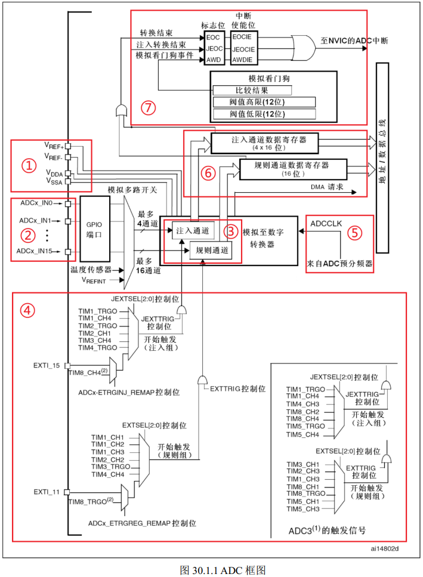
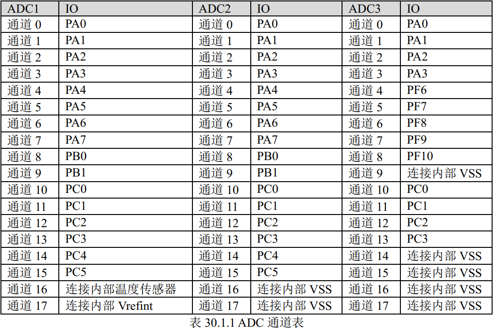
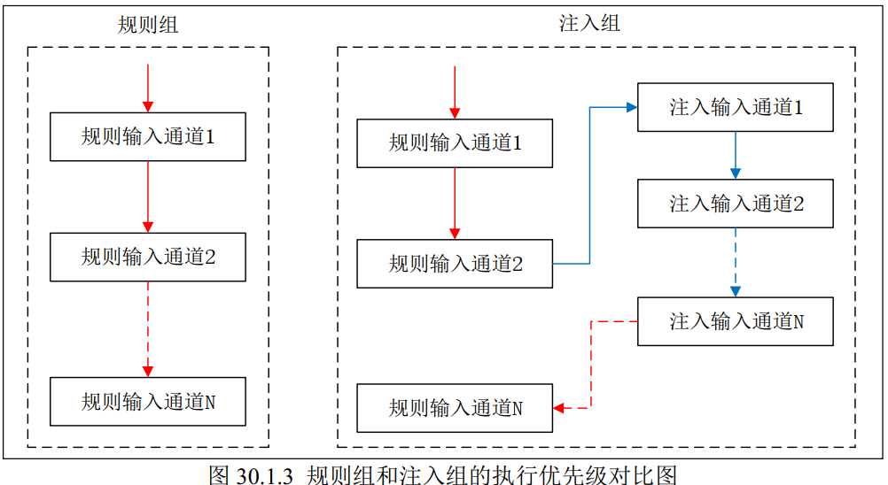
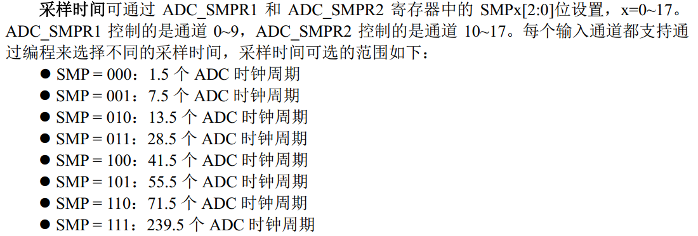
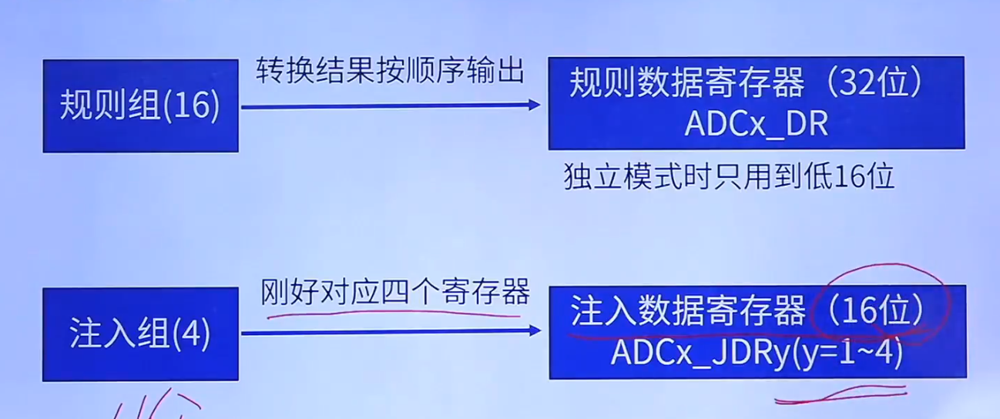
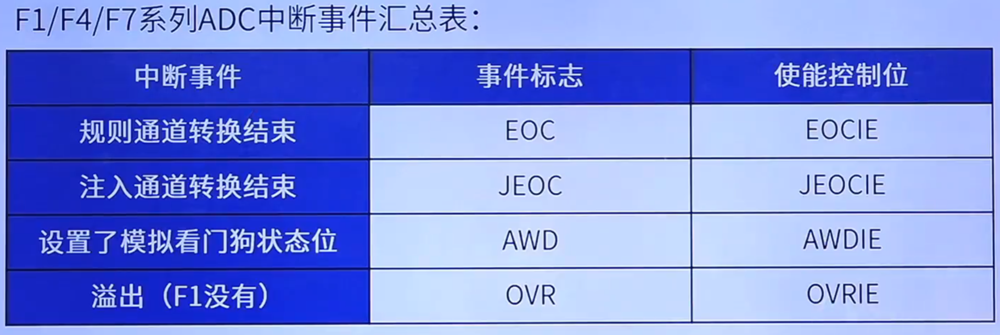
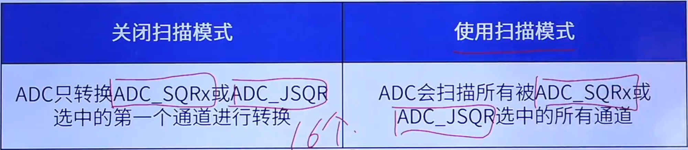

## ADC的概念

ADC（Analog to Digital Converter），即模拟/数字转换器。顾名思义是将模拟量转换为数字量的外设。比如压力传感器、温度传感器等将采集的数据转换为电压再通过ADC转换为数字量从而令CPU处理，CPU处理的量一般是数字量。

ADC 可以分为并联分压型和 逐次逼近型，STM32F1都是逐次逼近型。STM32有三个ADC，ADC1和ADC2各有16个外部通道和2个内部通道，ADC3则只有8个外部通道。

## ADC的特性参数

**分辨率：**表示ADC能辨别的最小模拟量，用**二进制位数**表示，比如：8、10、12、16位等。这意味着**其能将输入的模拟信号量化为 $2^{分辨率}$ 个等级**，如STM32F103的分辨率是12位，即可以将输入的模拟信号量量化为4096个等级。最小模拟量即一个等级的大小，例如3.3V/4096=0.0008V。

**转换时间：**表示完成一次A/D转换所需要的时间，转换时间越短，采样率就越高。

**精度：**最小刻度基础上**叠加各种误差的参数**，精度受ADC性能、温度和气压等影响。

**量化误差：**用数字量近似表示模拟量，采用四舍五入原则，此过程产生的误差为量化误差。

## ADC工作原理

### **①输入电压：**

负责为ADC供电，包括参考电压和模拟部分电压，共同决定ADC的输入电压范围。

### ②输入通道：

外部输入电压通过输入通道输送到 ADC 转换器中，外部通道是复用GPIO而成。 

### ③转换顺序：

多个输入通道一起工作时他们的转换顺序有先后之分，一般分成两组：**规则组和注入组**。规则组内部通道们的转换顺序称为规则序列，注入组内部通道们的转换顺序称为注入序列。这两个序列都是可设置的，可以任意设定某个输入通道的转换顺序。

**规则组允许最多 16 个**输入通道进行转换，而**注入组允许最多 4 个**输入通道进行转换，**注入组通道可以打断规则组通道转换**，相当于有更高的优先级，其也会如中断一般保留现场，在执行完注入组序列后再转回规则组。

  

### ④触发源：

触发转换的两种方式：

- 直接写寄存器ADC_CR2的ADON位触发
- 通过外部事件触发转换，例如定时器捕获、外部中断EXTI 线和软件触发，**常用的触发源在原理图中已经标明。**可以分为规则组外部触发和注入组外部触发。

### ⑤转换时间：

ADC的时钟源来自PCLK2（APB2总线），首先经过ADC预分频器**（分频系数2/4/6/8）**，ADC的最大时钟频率是14MHz，要确保合理设定预分频系数，不能超过ADC允许的最大时钟频率。

ADC转换时间：$T_{CONV}=采样时间+12.5个周期$

采样时间可以通过如下方法设置

### ⑥数据寄存器：

ADC 转换完成后的数据输出寄存器，根据转换组的不同，规则组的完成转换的数据输出到ADC_DR 数据寄存器，注入组的完成转换的数据输出到 ADC_JDRx 数据寄存器。规则组最多有 16 个输入通道，而ADC 规则数据寄存器只有一个，所以当通道转换完成后要及时把数据取走，比较常用的方法是使用 DMA 模式。

F1的规则数据寄存器有32位，多个通道共用。独立模式（只有一个ADC工作）只用到低16位。在双 ADC 模式下， 高 16 位用于保存 ADC2 转换的数据，低 16 位用于保存 ADC1 转换的数据。  

注入数据寄存器每个通道独享一个，一共四个，都是十六位。

### ⑦中断：

ADC 中断可分为三种：**规则组转换结束中断、注入组转换结束中断、设置了模拟看门狗状态位中断**。它们都有独立的中断使能位和标志位。

模拟看门狗中断发生条件：首先通过ADC_LTR和ADC_HTR寄存器**设置低阈值和高阈值**，然后开启了模拟看门狗中断后，当被 ADC **转换的模拟电压低于低阈值或者高于高阈值时**，就会产生中断。  

规则组和注入组的**每个通道**转换结束后，除了可以产生中断外，还可以产生 DMA 请求，我们利用DMA 及时把转换好的数据传输到指定的内存里，防止数据被覆盖。

## 单次转换模式和连续转换模式

### 单次转换模式

该模式下， **ADC 只执行一次转换就产生转换结束中断并停止**，  由我们前面说过的触发源触发。具体工作流程如下：如果规则组的一个输入通道被转换，那么转换的数据被储存在 16 位 ADC_DR 寄存器中、EOC（转换结束）标志位被置 1、如果设置了 EOCIE 位，则产生中断，然后 ADC 停止。如果注入组的一个输入通道被转换，那么转换的数据被储存在16位ADC_DRJx寄存器中、JEOC（转换结束）标志位被置 1、如果设置了 JEOCIE 位，则产生中断，然后 ADC 停止。

### 连续转换模式

该模式下， ADC 完成上一个通道的转换后会马上自动地启动下一个通道的转换，与单次转换模式的区别就是一个通道转换结束后不会停止。

**如果使能了转换完成中断，那么每一个通道转换完成后都会产生中断**。如果规则组的一个输入通道被转换，那么转换的数据被储存在 16 位 ADC_DR 寄存器中、EOC（转换结束）标志位被置 1、如果设置了 EOCIE 位，则产生中断。如果注入组的一个输入通道被转换，那么转换的数据被储存在16位ADC_DRJx寄存器中、JEOC（转换结束）标志位被置 1、如果设置了 JEOCIE 位，则产生中断。

## 扫描模式

