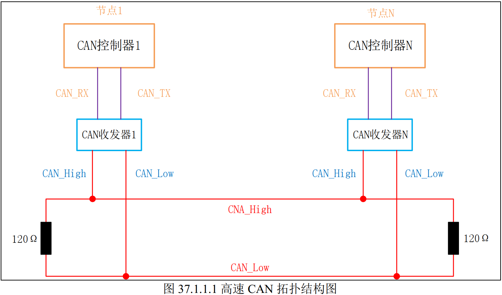
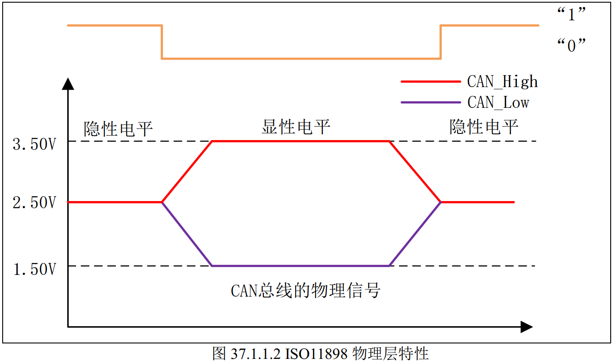
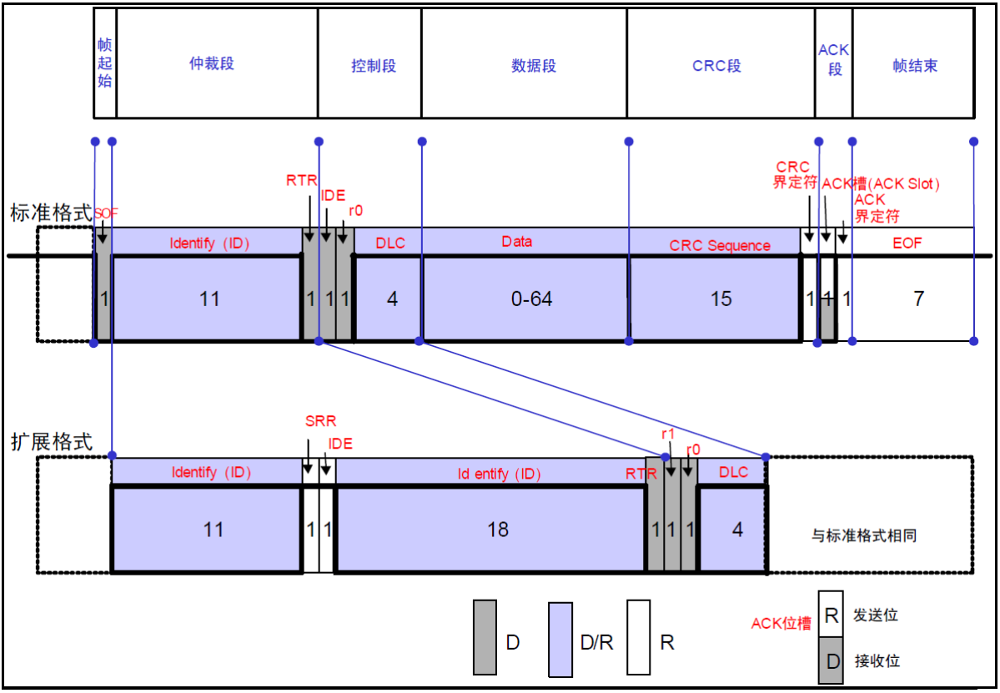
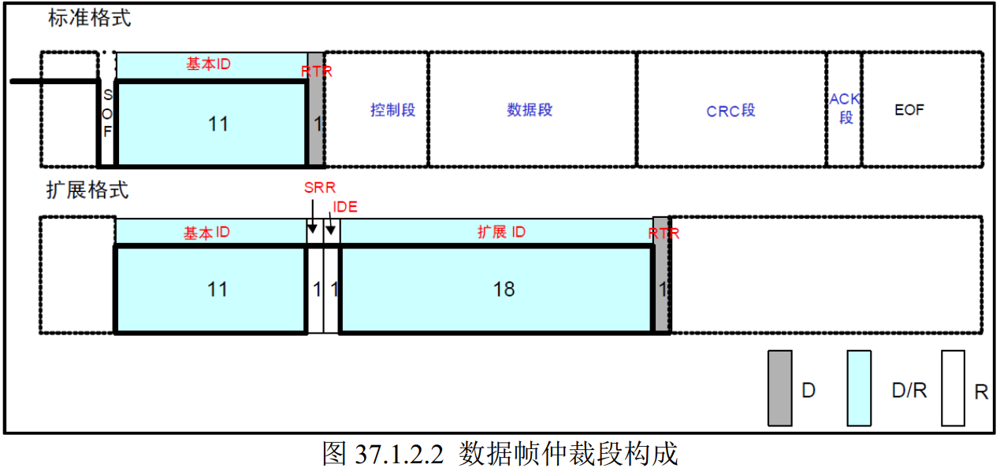
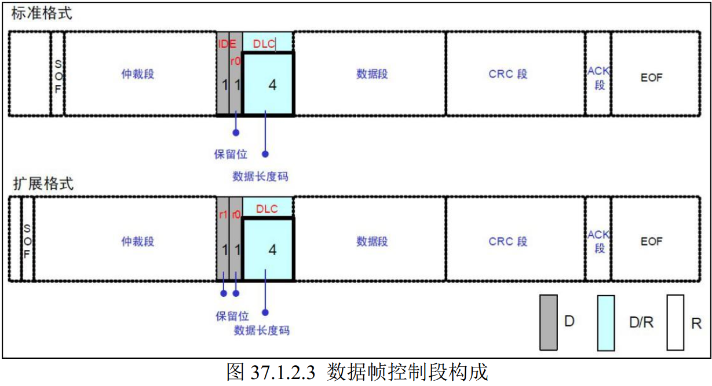
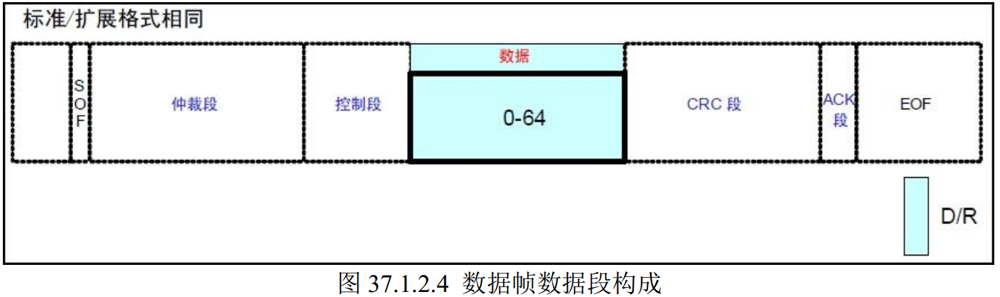
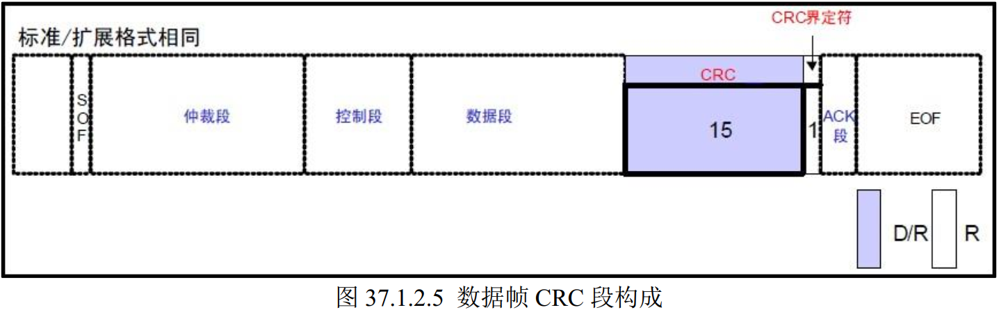
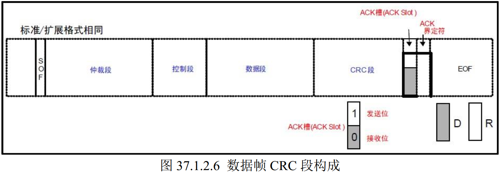

## CAN的概念

CAN （Controller Area Network）是 ISO 国际标准化的**半双工串行**通信协议。  多个设备之间进行通信时存在多条总线的情况，为了**减少线束的数量**，1986 年德国电气商博世公司开发出面向汽车的 CAN 通信协议。

CAN协议具备以下特点：

1. **多主控制。**不存在主从关系，所有连接在总线上的单元都**没有地址**，都可以发送消息，多个单元同时发送消息时**根据消息的标识符（Identifier，ID，即消息的重要性）决定消息优先级**。优先级高的消息继续发送，低的单元立刻停止发送进行接收。
2. **通信速度快，通信距离远。**最高1Mbps（距离小于40M），最远可达10KM（速率低于5Kbps）。
3. **具备错误检测、错误通知、错误恢复功能。**所有单元都可以**检测错误（错误检测功能）**，检测出错误的单元会立即同时**通知其他所有单元（错误通知功能）**，正在发送消息的单元一旦检测出错误，会强制结束当前的发送。强制结束发送的单元会不断反复地**重新发送此消息直到成功发送为止（错误恢复功能）**。  
4. **故障封闭功能。**CAN可以判断出错误的类型是总线上暂时的数据错误（如外部噪声等）还是持续的数据错误（如单元内部故障、驱动器故障、断线等）。由此功能，当总线上发生持续数据错误时，可将引起此故障的单元从总线上隔离出去。  
5. **连接节点多。**CAN总线是可同时连接多个单元的总线。可连接的单元总数理论上是没有限制的。但实际上可连接的单元数受总线上的时间延迟及电气负载的限制。降低通信速度，可连接的单元数增加；提高通信速度，则可连接的单元数减少。  

### CAN物理层

高速 CAN 总线呈现的是一个闭环结构（低速CAN是开环总线，CAN_High和CAN_Low各有1个电阻），总线是由两根线 CAN_High 和CAN_Low 组成， 且在总线两端各串联了 120Ω的电阻（用于**阻抗匹配，减少回波反射**）， 同时总线上可以挂载多个节点(低速CAN20个，高速CAN30个)。  

每个节点都有CAN控制器，一般是MCU的片上外设，**CAN收发器则是外接的电平转换电路**，它的职责是将CAN控制器Tx和Rx输出的**逻辑电平信号**（如TTL/CMOS电平）转换为适合在双绞线上传输的**差分电压信号**（CAN_H 和 CAN_L），反之亦然。

CAN总线**通过差分信号传输数据**，根据 CAN 总线上两根线的电位差来判断总线电平。

| 电平              | 高速CAN                  | 低速CAN                    |
| ----------------- | ------------------------ | -------------------------- |
| 显性电平（逻辑0） | $U_{CAN_H}-U_{CAN_L}=2V$ | $U_{CAN_H}-U_{CAN_L}=3V$   |
| 隐性电平（逻辑1） | $U_{CAN_H}-U_{CAN_L}=0V$ | $U_{CAN_H}-U_{CAN_L}=1.5V$ |

**显性电平对应逻辑 0**， CAN_H 和 CAN_L 之差为 2V 左右。而**隐性电平对应逻辑 1**， CAN_H 和 CAN_L 之差为 0V。在总线上显性电平具有优先权，只**要有一个单元输出显性电平，总线上即为显性电平**。而隐形电平则具有包容的意味，**只有所有的单元都输出隐性电平，总线上才为隐性电平**（显性电平比隐性电平更强）。  

显性电平逻辑0和隐性电平逻辑1是对连接到CAN总线的节点而言的，即CAN控制器，其输出和读取逻辑电平，而对于CAN收发器来说，当它需要发送一个**逻辑0**（通常表示“有数据”或“优先级高”）时，它会驱动总线进入显性状态（即令CAN_H 和 CAN_L 之差为 2V左右 ）。

### CAN协议层

CAN协议有多种类型的帧，其中数据帧和遥控帧有标准格式和扩展格式两种格式。标准格式有 11 个位的标识符（ID），扩展格式有 29 个位的 ID。  

| 帧类型 | 帧用途                                           |
| ------ | ------------------------------------------------ |
| 数据帧 | 用于发送单元向接收单元传送数据的帧               |
| 遥控帧 | 用于接收单元向具有相同 ID 的发送单元请求数据的帧 |
| 错误帧 | 用于当检测出错误时向其它单元通知错误的帧         |
| 过载帧 | 用于接收单元通知其尚未做好接收准备的帧           |
| 间隔帧 | 用于将数据帧及遥控帧与前面的帧分离开来的帧       |

#### CAN数据帧结构

D：显性电平。R：隐性电平。

**帧起始**（SOF）：标准帧和扩展帧都是由 1 个位的显性电平表示帧起始。

**仲裁段**：表示该帧数据优先级的段 ，具体如下：

**标准格式**。RTR：标识是否是远程帧（0，数据帧； 1，远程帧） 。

**扩展格式。**IDE ：标识符选择位（0，使用标准标识符； 1，使用扩展标识符）。 SRR ：代替远程请求位，为隐性位，它**代替了标准帧中的 RTR 位**。  

**控制段**：由 6 个位构成，表示数据段的字节数。  

IDE ：标识符选择位（0，使用标准标识符； 1，使用扩展标识符，决定是扩展帧还是标准帧）。

DLC：表示数据段的数据长度，高位在前，可接收范围是0-15，但有效范围是0-8。

**数据段**：该段可包含 0~8 个字节的数据。从最高位（MSB）开始输出，标准帧和扩展帧都是一样。  

**CRC 段**：用于检查帧传输错误。由15位的 CRC 顺序和 1 位的 CRC 界定符（用于分隔的位）组成。

发送方和接收方会以同样的算法计算CRC段之前的所有数据的 CRC 值并进行比较，不一致时会通报错误。  

**ACK 段**：此段用来确认是否正常接收。由 ACK 槽(ACK Slot)和 ACK 界定符 2 个位组成。 

发送单元的 ACK，**发送 2 个位的隐性位**，而接收到正确消息的单元**在 ACK 槽（ACK Slot）发送显性位**，通知发送单元正常接收结束，这个过程叫发送 ACK/返回 ACK。  

**帧结束**（EOF）：由 7 个位的隐性位组成。   

#### CAN的位时序

看野火的教程