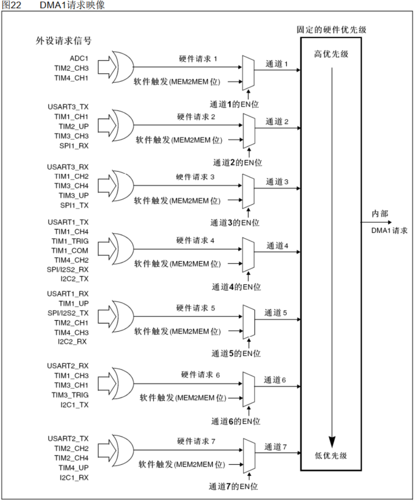
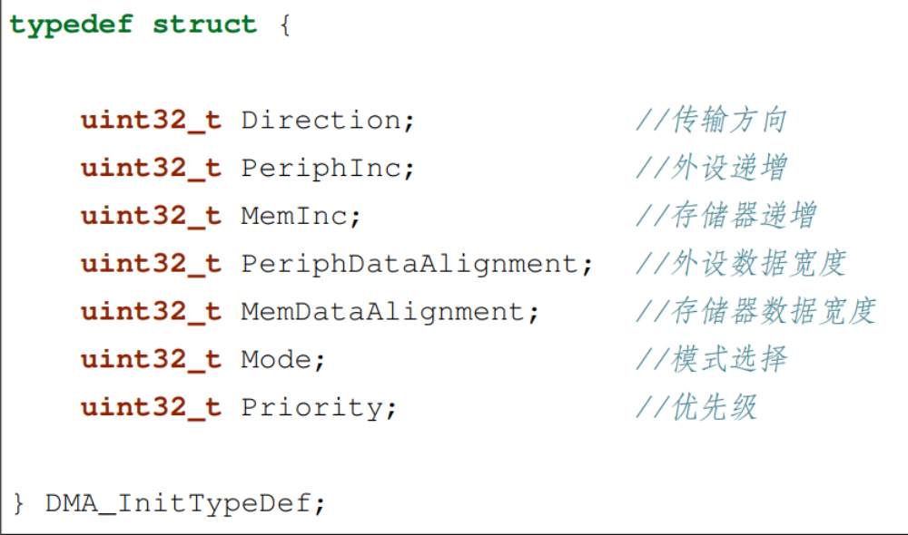
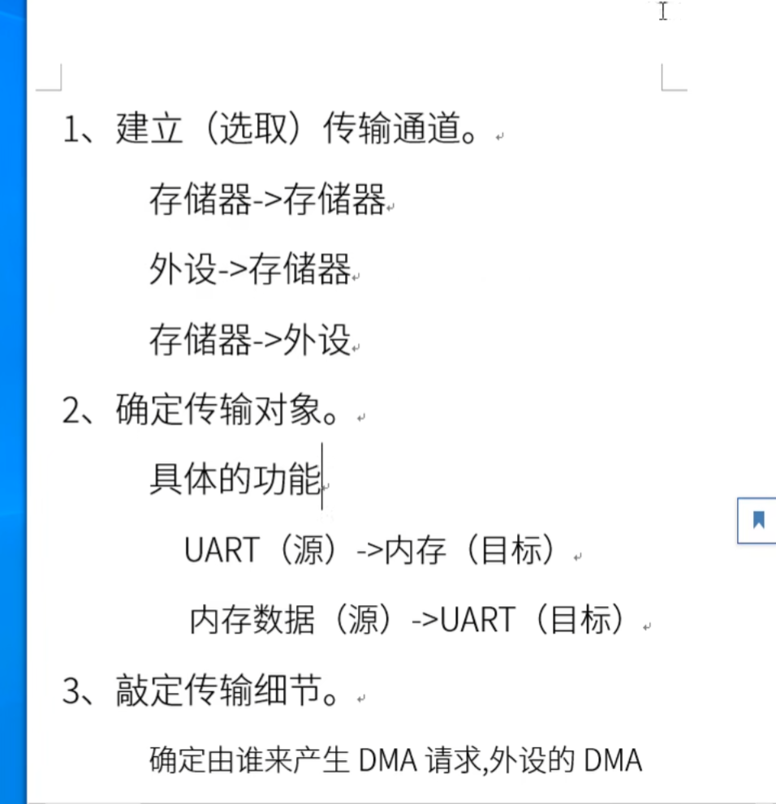

## DMA的概念

DMA，全称为： Direct Memory Access，即直接存储器访问。 DMA 传输方式无需 CPU 直接控制传输，也没有中断处理方式那样保留现场和恢复现场的过程，数据传输支持从外设到存储器或者存储器到存储器，这里的存储器可以是 SRAM 或者是 FLASH。  

STM32F103 内部有 2 个 DMA 控制器(DMA2 仅存大容量产品中)， DMA1 有 7 个通道。DMA2 有 5 个通道。每个通道专门用来管理来自于一个或多个外设对存储器访问的请求。还有一个仲裁器来协调各个 DMA 请求的优先权。

DMA的每个通道都直接连接专用的硬件DMA请求，每个通道也都支持软件触发。具体哪个DMA的哪个通道对应哪个外设可以在参考手册中查到。值得注意的是内存到内存（MEM2MEM）可以对应任意一个通道，而且需要软件触发。

虽然每个通道可以接收多个外设的请求，但是同一时间只能接收一个，不能同时接收多个。  而且对DMA控制器来说，同一时间只有一个通道的请求有效，当产生多个和DMA通道请求时，由仲裁器管理按优先级先后响应处理。在初始化时可以软件设定DMA请求的优先级：有4个等级：非常高，高，中和低四个优先级。  而当优先级相同时，则取决于通道编号，编号越低优先权越高，比如通道 0 高于通道 1。  

DMA初始化要注意的几项：

| 名称     | 位数 | 字节数 | 常见用途             |
| -------- | ---- | ------ | -------------------- |
| Byte     | 8    | 1      | 字符、小整数         |
| Halfword | 16   | 2      | `short` 整数         |
| Word     | 32   | 4      | `int`, `float`, 指令 |

## HAL库中外设驱动的实现

对任意外设，其初始化都需要以下结构体：

### 1.外设句柄结构体（xx_HandleTypeDef）:

成员 Instance 指向一个具体的外设成员（实际上是一个指向外设基地址的指针）。如：UART中的UART1、UART2等，DMA里的Channel1、Channel2等。

成员 Init 指向一个具体外设的初始化结构体，用来配置外设的工作参数。

### 2.初始化结构体（xx_InitTypeDef）:

 根据外设的各种配置寄存器，组织起来的外设参数配置结构体，内附在外设句柄结构体xx_HandlleTypeDef里，上面提到的成员 Init 就是初始化结构体类型的变量。

## DMA实验相关

目的：使用DMA在memory到memory之间搬运数据，使用DMA实现串口的收发数据。

## DMA实现串口收法数据的几种不同方法

