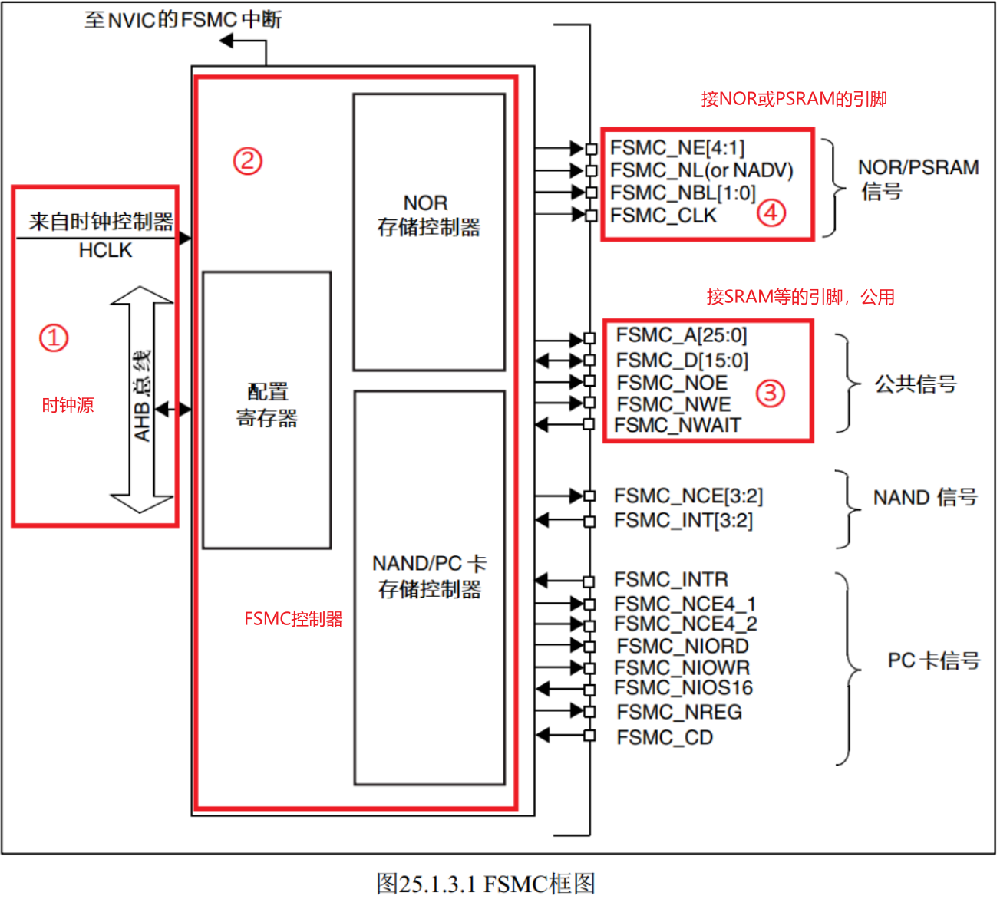
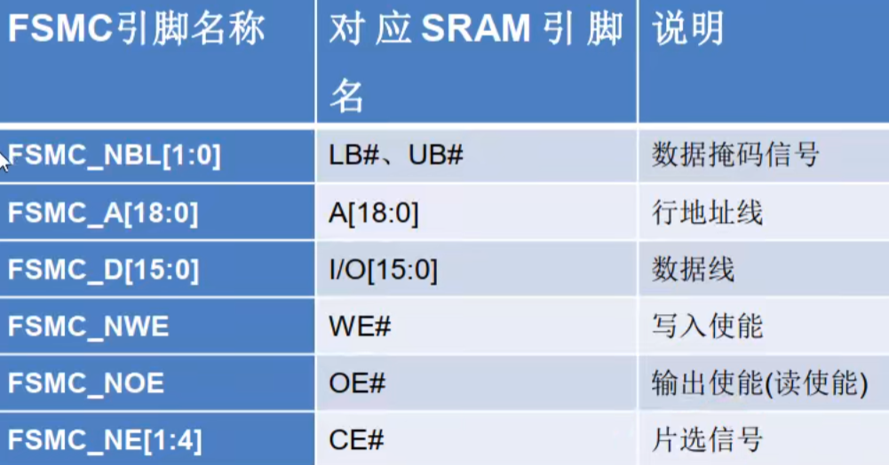
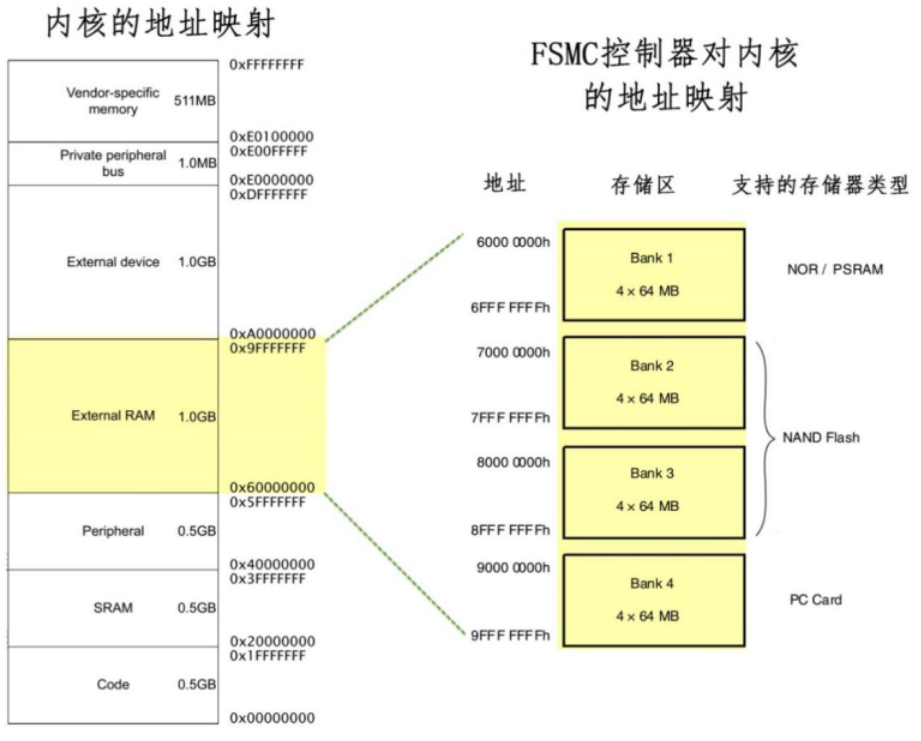
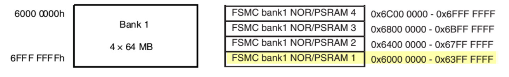
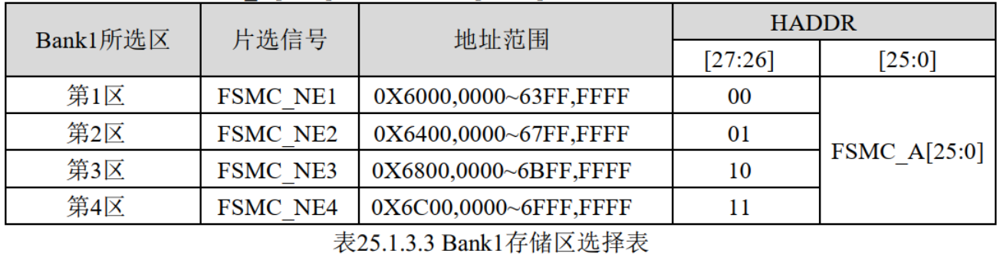
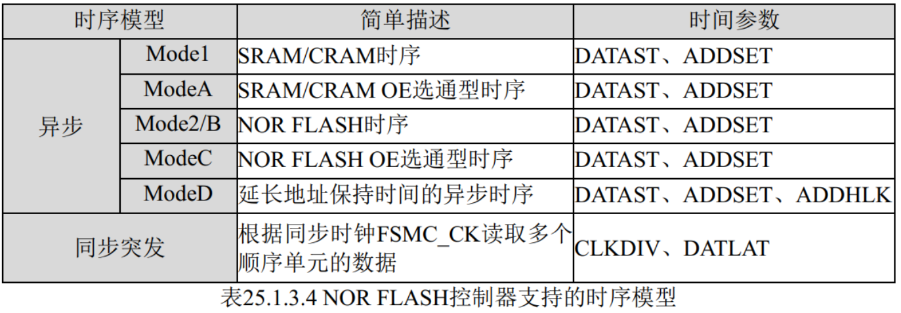
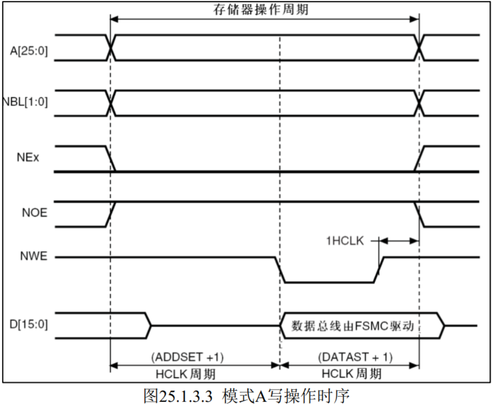
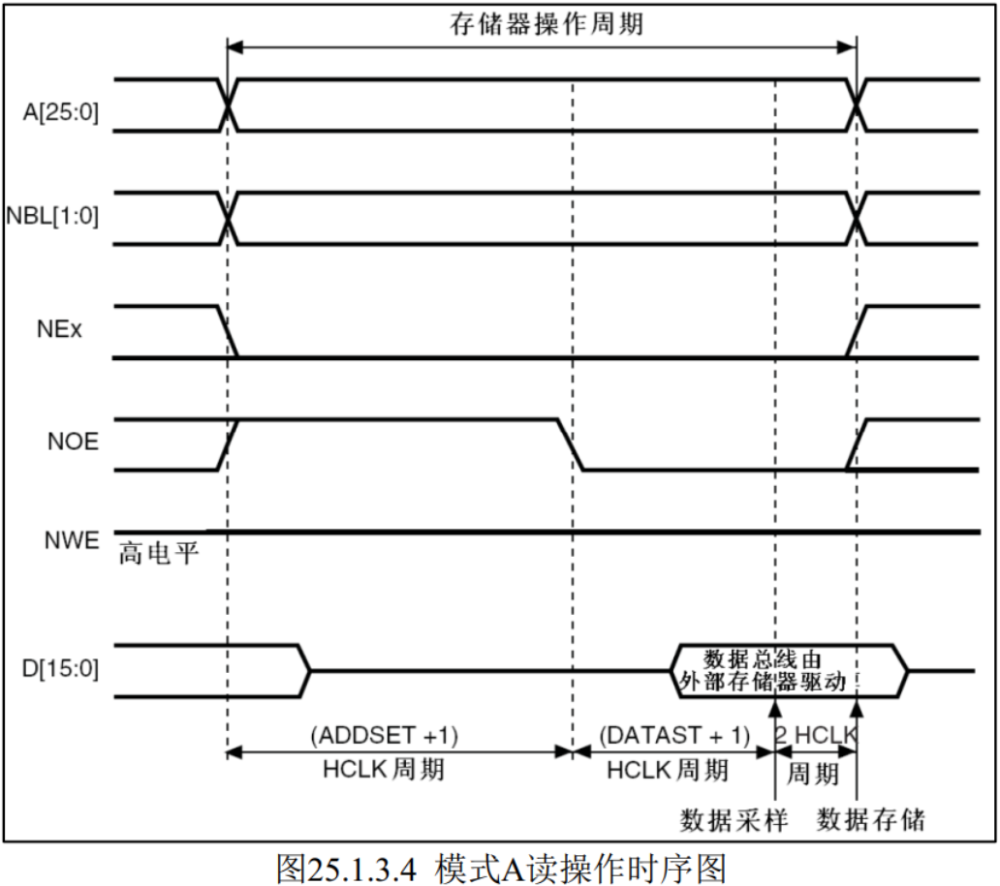

## FSMC的概念

STM32芯片可以外接存储器来扩展存储，FSMC（Flexible Static Memory Controller）即灵活的静态存储控制器就是**用来管理扩展的存储器**的，其可以通过地址信号快速找到存储器对应存储块上的数据。它可以用于驱动包括 SRAM、 NOR FLASH 以及 NAND FLSAH 类型的存储器，不能驱动动态的存储器如SDRAM等。

由于 FSMC 外设可以用于控制扩展的外部存储器，而 MCU 对液晶屏的操作实际上就是**把显示数据写入到显存中**，与控制存储器非常类似，且 8080 接口的通讯时序完全可以使用 FSMC 外设产生，因而非常适合使用 FSMC 控制液晶屏。  

## FSMC工作原理

FSMC框图中 ③公共信号 是所有控制器共用的，而 ④中的FSMC_NE有四个，对应STM32内部四个不同的地址区域，当使用不同的FSMC_NE引脚连接外部存储器时，FSMC_NE片选信号拉低时，STM32访问外部存储的地址不一样，从而达到控制多个外部存储器芯片的目的。因此四个片选引脚最多支持扩展四个外部存储芯片。

**数据掩码**（Data Mask）是一个非常重要的功能，主要用于控制对 16 位或 32 位外部存储器进行**字节级**（8 位）的写操作。FSMC 通常连接的是 16 位（如 SRAM、NOR Flash）或 32 位的外部存储器。这些存储器的数据总线是 16/32 位宽的，意味着每次读写操作理论上会传输一个完整的 16/32 位数据。但实际应用中，我们经常需要只修改其中的**一个字节**（例如，只想改高字节或低字节）。这时就需要“数据掩码”来告诉 FSMC：“我只想更新某些字节，其他字节保持原样”。

## FSMC的地址映射

FSMC 连接好外部的存储器并初始化后，就可以**直接通过访问地址来读写数据**，这种地址访问与I2C访问EEPROM、 SPI访问 FLASH 的不一样，后两种方式都需要控制 I2C 或 SPI 总线给存储器发送地址，然后获取数据；在程序里，这个地址和数据都需要分开使用不同的变量存储，并且访问时还需要使用代码控制发送读写命令。而**使用 FSMC 外接存储器时，其存储单元是映射到 STM32 的内部寻址空间**的；在程序里，定义一个指向这些地址的指针，然后就**可以通过指针直接修改该存储单元的内容**， FSMC 外设会自动完成数据访问过程，读写命令之类的操作不需要程序控制。

图中左侧的是 Cortex-M3 内核的存储空间分配，右侧是 STM32 FSMC 外设的地址映射。  

FSMC 把整个 External RAM 存储区域分成了 4 个 Bank 区域，并分配了地址范围及适用的存储器类型，如 NOR 及SRAM 存储器只能使用 Bank1 的地址。在每个 Bank 的内部又分成了 4 个小块，**每个小块有相应的控制引脚用于连接片选信号**，如 FSMC_NE[4:1] 信号线可用于选择 BANK1 内部的 4 小块地址区域。

直接使用指针访问这些地址就可以对外部扩展的RAM读写数据。

## FSMC读写时序

FSMC通常根据其控制的存储器类型和时序特性，分为以下几种**工作模式**：

1. **异步模式 (Asynchronous Mode)**：
   - 用于连接**没有固定时钟**的存储器，如异步SRAM、ROM等。
   - 时序由地址建立时间（ADDSET）、数据建立时间（DATAST）等参数控制。
   - 每次访问都独立，不需要同步时钟。
2. **同步模式 (Synchronous Mode)**：
   - 用于连接有同步时钟的存储器，如PSRAM（伪静态RAM）。
   - FSMC提供时钟信号（CLK），存储器的操作与时钟同步。
   - 时序由时钟周期和等待状态等参数决定。

FSMC 综合了 SRAM／ ROM、 PSRAM 和 NOR Flash 产品的信号特点，定义了 4 种不同的异步时序模型。选用不同的时序模型时，需要设置不同的时序参数，其异步和同步时序模型的简单描述如下表所示：

TFTLCD一般读速度慢而写速度快，而FSMC的ModeA支持独立的读写时序控制，ModeA的读写时序如下所示：

一个存储器操作周期由地址建立周期（ADDSET）、数据建立周期（DATAST）组成。它们的单位是AHB总线时钟HCLK

具体来说，这个图描述了CPU通过FSMC向外部存储器写入数据的过程。

1. **阶段1：地址和片选建立**
   - `A[25:0]` (地址) 和 `NBL[1:0]` (字节使能) 被置为有效值。
   - `NEx` (片选) 变为低电平（有效），选中目标存储器。
   - 此阶段持续 `(ADDSET + 1)` 个 HCLK 周期。确保地址和片选信号在后续操作前已稳定。
2. **阶段2：写操作启动**
   - `NWE` (写使能) 变为低电平（有效）。
   - `NOE` (读使能) 保持高电平（无效）。
   - 此时，FSMC开始将要写入的数据驱动到数据总线 `D[15:0]` 上。图中明确标注“**数据总线由FSMC驱动**”。
3. **阶段3：数据稳定与写入**
   - `NWE` 保持低电平。
   - `D[15:0]` 上的数据必须在 `NWE` 有效期间稳定。
   - 外部存储器在 `NWE` 有效且地址/片选有效的条件下，会将 `D[15:0]` 上的数据锁存到内部。
   - 这个阶段的持续时间由 `DATAST` 参数决定。`(DATAST + 1)` 个 HCLK 周期后，数据应**已稳定并被存储器接收**。
4. **阶段4：操作结束**
   - `NWE` 变为高电平（无效），写操作完成。
   - `NEx` 保持低电平一段时间（可选的等待状态），然后变为高电平（取消片选）。
   - `D[15:0]` 上的数据可以被释放。

读操作的一个存储器操作周期由地址建立周期(ADDSET)和数据建立周期(DATAST)以及 2 个 HCLK 周期组成。具体来说，这个图描述了CPU通过FSMC从外部存储器读取数据的过程。

1. **阶段1：地址和片选建立**
   - `A[25:0]` (地址) 和 `NBL[1:0]` (字节使能) 被置为有效值。
   - `NEx` (片选) 变为低电平（有效），选中目标存储器。
   - 此阶段持续 `(ADDSET + 1)` 个 HCLK 周期。确保地址和片选信号在后续操作前已稳定。
2. **阶段2：读操作启动**
   - `NOE` (读使能) 变为低电平（有效）。
   - `NWE` (写使能) 保持高电平（无效）。
   - 此时，外部存储器响应 `NOE` 信号，开始将存储在指定地址的数据放到其数据输出端口上。
3. **阶段3：数据稳定与采样**
   - `NOE` 保持低电平。
   - 外部存储器将其数据驱动到 `D[15:0]` 上。图中明确标注“**数据总线由外部存储器驱动**”。
   - `D[15:0]` 上的数据必须在 `NOE` 有效期间稳定。
   - FSMC会在 `NOE` 有效后的某个时刻（通常是 `NOE` 变低后的第 `(DATAST + 1)` 个HCLK周期）采样 `D[15:0]` 上的数据。
   - 这个阶段的持续时间由 `DATAST` 参数决定。`(DATAST + 1)` 个 HCLK 周期后，数据应已稳定可供采样。
4. **阶段4：数据存储与操作结束**
   - `NOE` 变为高电平（无效）。
   - 一旦 `NOE` 无效，外部存储器可能会停止驱动数据。
   - **为了保证数据完整，FSMC通常会再保持一个额外的HCLK周期（图中标注“2 HCLK周期”）来确保数据在内部寄存器中稳定存储。**
   - `NEx` 保持低电平一段时间（可选的等待状态），然后变为高电平（取消片选）。

## FSMC模拟8080时序

FSMC支持的读写模型模式2/B与LCD控制芯片使用的8080时序十分相似，使用FSMC模拟8080时序时，他们的信号线对比如下所示：

| FSMC(NOR/PSRAM)  | 功能         | 8080 信号线 | 功能              |
| ---------------- | ------------ | ----------- | ----------------- |
| FSMC_NEx         | 片选信号     | CSX         | 片选信号          |
| FSMC_NWR         | 写使能       | WRX         | 写使能            |
| FSMC_NOE         | 读使能       | RDX         | 读使能            |
| FSMC_D[15:0]     | 数据信号     | D[17:0]     | 数据信号          |
| **FSMC_A[25:0]** | **地址信号** | **D/CX**    | **数据/命令选择** |

对于 FSMC 和 8080 接口，前四种信号线都是完全一样的，仅仅是 FSMC 的地址信号线 A[25:0] 与8080 的数据/命令选择线 D/CX 有区别。而对于 D/CX 线，它为高电平的时候表示数值，为低电平的时候表示命令，**从 FSMC 的 A 地址线中挑出一根来表示D/CX。**

