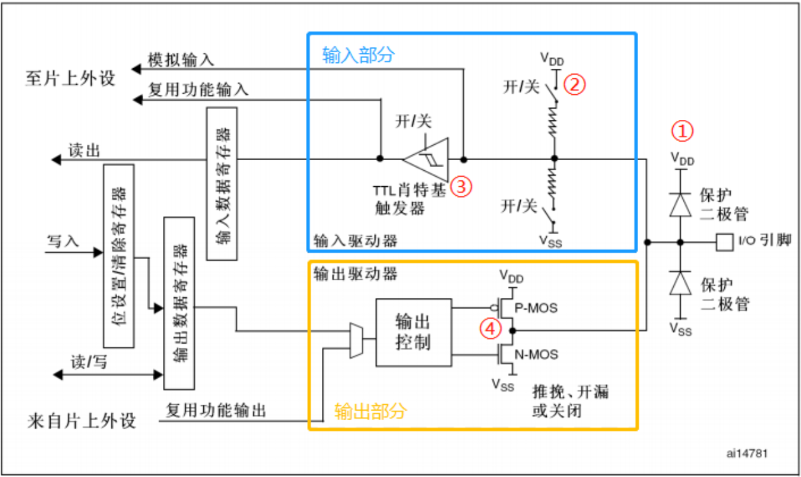

## GPIO的八种工作模式

① **保护二极管**。将输入电压锚定在-0.3V–3.6V之间，当引脚输入电压高于VDD 时，上面的二极管导通，当引脚输入电压低于 VSS 时，下面的二极管导通，从而使输入芯片内部的电压处于比较稳定的值  。

② **上下拉电阻**。没有外部输入的电压时，没有外部的上、下拉电压，引脚的电平由引脚内部上、下拉决定，开启内部上拉电阻工作，引脚电平为高，开启内部下拉电阻工作，则引脚电平为低。  

③ **施密特触发器**。施密特触发器可作为波形整形电路，能将模拟信号波形整形为数字电路能够处理的方波。

④ **P-MOS和N-MOS管**。用来控制GPIO引脚的开漏输出和推挽输出两种模式。

### 输入浮空

内部上/下拉电阻均断开，施密特触发器打开，输出禁止。**IO口电平完全由外部电路决定**。

### 输入上拉

上拉电阻导通，施密特触发器打开，输出被禁止。**IO口默认输入高电平**（空闲时），但如果有外部电路输出，则IO读出的是加载IO口上的外部电平。

### 输入下拉

下拉电阻导通，施密特触发器打开，输出被禁止。与上拉输入相对，**IO口默认输入低电平**（空闲时），但如果有外部电路输出，则IO读出的是加载IO口上的外部电平。

### 模拟输入

上下拉电阻断开，施密特触发器**关闭**（与浮空输入的区别），双MOS管关闭。外部电路可以通过模拟通道输入输出。

### 开漏输出

上下拉电阻断开，施密特触发器打开，此时IO口可以承担输入工作，可以看做是**浮空输入**。开漏输出模式下，因为施密特触发器仍工作，因此仍可以读取IO引脚状态。

P_MOS始终不导通，通过控制N_MOS的导通与否控制IO输出电平，开漏输出**只能输出低电平或高阻态**，若要使之输出高电平只能采取在芯片外部接上拉电阻的形式。

### 推挽输出(Push-Pull Output)

上下拉电阻断开，施密特触发器打开，此时IO口可以承担输入工作，可以看做是**浮空输入**。开漏输出模式下，因为施密特触发器仍工作，因此仍可以读取IO引脚状态。

通过控制N_MOS和P_MOS的导通与否控制IO输出电平，推挽输出**只能输出低电平或高电平**。

### 开漏式复用

复用是指一个IO口可以是通用的 IO 口功能，**还可以是其他外设的特殊功能引脚**。一个 IO 口可以是多个外设的功能引脚，但我们需要选择作为其中一个外设的功能引脚。  使用复用功能时，引脚的状态是由对应的外设控制，**复用引脚的输出就是对应外设的输出**。开漏模式下只能输出低电平或高阻态。

复用引脚是为了对应外设的表达而产生的，因此复用输入用的比较少。

与开漏输出相同，施密特触发器是打开的，可以读取 IO 口的电平状态，同时外设可以读取 IO 口的信息。  

### 推挽式复用

与开漏复用类似，只是只能输出高电平和低电平。

## HAL库GPIO工作流程

HAL库函数功能可以在stm32f1xx_hal_gpio.c中找到all i need