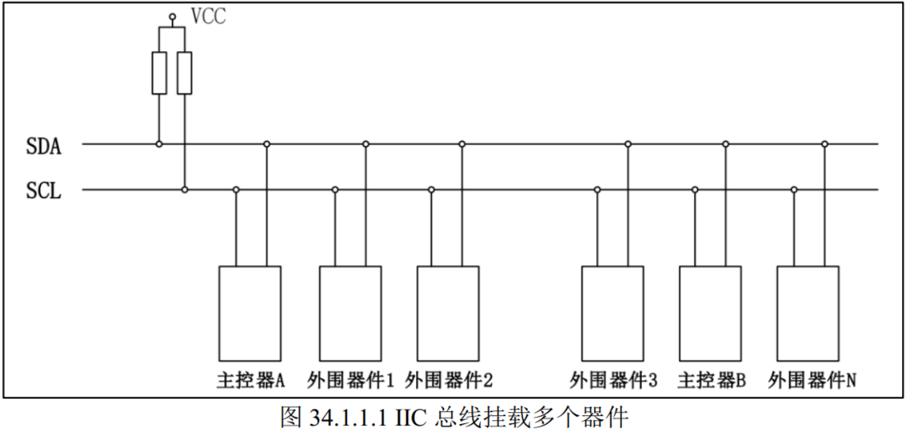
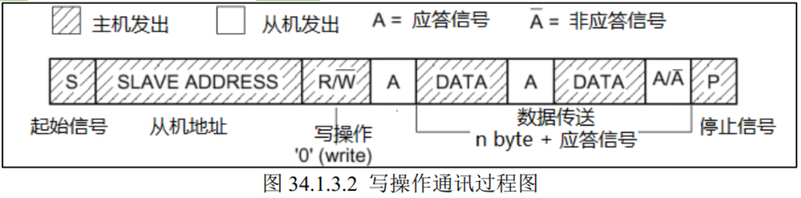
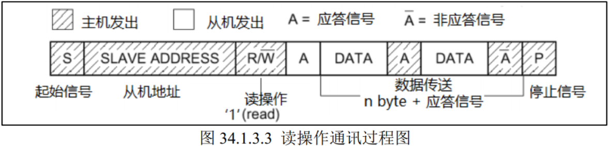
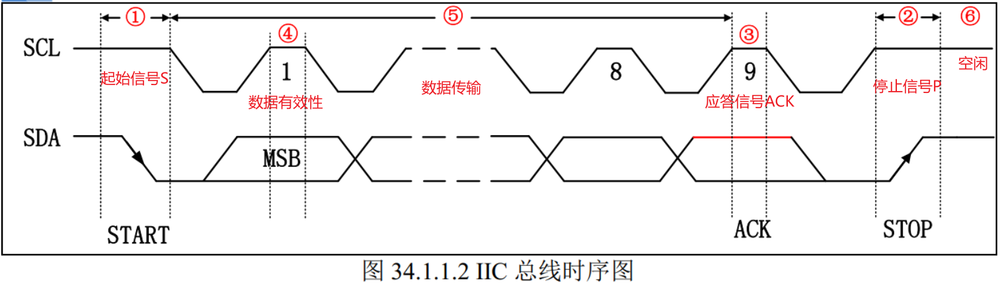
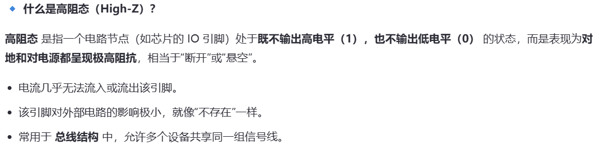

## IIC的概念

IIC(Inter-Integrated Circuit)总线是一种由 PHILIPS 公司开发的两线式串行总线，用于连接微控制器以及其外围设备。由数据线 SDA 和时钟线 SCL 构成的串行总线，可发送和接收数据，在 CPU 与被控 IC 之间、 IC 与 IC 之间进行双向传送。  

IIC是一种**半双工串行通信**。

### IIC物理层

IIC物理层具备以下特点：

1. 总线指多个设备共用的信号线，这IIC中总线包括数据线SDA和时钟线SCL，数据线用来一位位传输数据，时钟线用来同步数据收发。
2. 总线支持多设备连接，同时**支持多个主机和多个从机**，而当多个主机同时使用总线时，为了防止数据冲突，利用**仲裁**方式决定由哪个设备占用总线。连接到总线的接口数量只由总线电容400pF的限制决定。   
3. 每个连接到总线的设备都有一个独立且唯一的地址，只需知晓这个设备地址，就可以基于时序完成主机和外围设备间的通信。根据 I2C 协议，这个从机地址可以是 7位或 10 位。  
4. 数据线和时钟线都通过一个上拉电阻接到电源，因此两条总线**空闲时都是高电平**。
5. 总线上数据的传输速率在标准模式下可达 100kbit/s 在快速模式下可达 400kbit/s 在高速模式下可达 3.4Mbit/s。  

### IIC协议层

IIC的读写通讯过程包括主机写数据到从机（写操作）和主机读从机数据（读操作）。二者过程如下所示：

主机发送起始信号S->所有从机等待接收数据->主机发送从机地址+0（代表写操作）-> 对应地址的从机发回应答信号A -> 主机收到应答信号A后向从机**发送数据（DATA）数据包的大小为 8 位**，主机每发送完一个字节数据，都要等待从机的应答信号 (ACK)，重复这个过程  -> 数据传输结束，主机发送停止信号P

主机发送起始信号S->所有从机等待接收数据->主机发送从机地址+1（代表读操作）-> 对应地址的从机发回应答信号A ，并向主机返回8bit数据-> 主机向从机发送应答信号A，然后接收下一个8bit数据 -> 数据传输结束，主机发送停止信号P

### 几种不同信号的总线电平状态

上图是IIC两条总线的高低电平变化时序图。

**①起始信号S：**SCL为高电平，SDA由高到低**跳变**。该信号由主机发出，在起始信号产生后，总线就处于被占用状态，准备数据传输  

**②停止信号P：**SCL为高电平，SDA由低到高跳变。该信号由主机发出，在停止信号发出后，总线就处于空闲状态。  

**③应答信号ACK：**发送器每发送一个字节（8bit）数据，就在时钟脉冲 9 期间释放数据线，由接收器反馈一个应答信号。应答信号为**低电平时，规定为有效应答位**（ACK 简称应答位），表示接收器已经成功地接收了该字节；应答信号为**高电平时，规定为非应答位**（NACK），一般表示接收器接收该字节没有成功  

**④数据有效性：**SCL为高电平的时候，SDA表示的数据有效。在SCL为低电平期间，SDA上的高电平或低电平状态才允许变化，因此数据在 SCL 的上升沿到来之前就需准备好。  

**⑤数据传输：SDA数据线在SCL的每个时钟周期传送 1 bit 数据**，即在 SCL 串行时钟的配合下，在 SDA 上逐位地串行传送每一位数据。数据位的传输是边沿触发。  

**⑥空闲状态：**SDA和SCL总线都是高电平。

## STM32的IIC特性

### IIC片上外设（硬件）

STM32 的 I2C 片上外设专门负责实现 I2C 通讯协议，只要配置好该外设，它就会自动根据协议要求产生通讯信号，收发数据并缓存起来， CPU 只要检测该外设的状态和访问数据寄存器，就能完成数据收发。  

### 软件模拟IIC

控制GPIO两个引脚的输出，分别用作SCL和SDA，按照上述信号的时序要求直接控制引脚的输出（或读取），就可以实现IIC通讯。以这种方法可以实现各种通讯协议。

用软件模拟 IIC，最大的好处就是方便移植，同一个代码兼容所有 MCU，任何一个单片机只要有 IO 口，就可以很快的移植过去，而且不需要特定的 IO 口  

## IIC实验

