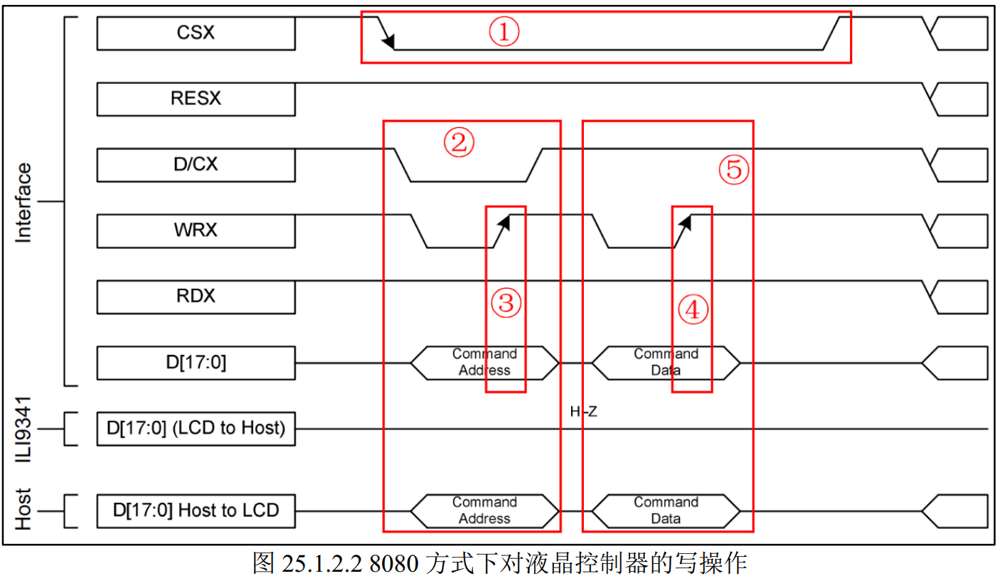
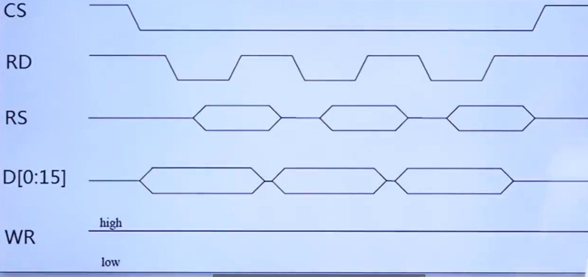

## LCD的概念

LCD（Liquid Crystal Display）即液晶显示器， 利用了液晶导电后透光性可变的特性，配合显示器光源、彩色滤光片和电压控制等工艺，最终可以在液晶阵列上显示彩色的图像。目前液晶显示技术以 TN、 STN、 TFT 三种技术为主， TFT-LCD 即采用了 TFT（Thin Film Transistor）技术的液晶显示器，也叫薄膜晶体管液晶显示器。  

液晶本身不发光，通过背光灯通过偏光片得到对应颜色输出的光，而OLED是可以自己发光的。

## TFTLCD控制信号

我手上正点原子2.8英寸TFTLCD模块的借口信号线如下：

| 名称     | 功能                                         |
| -------- | -------------------------------------------- |
| CS       | TFT-LCD 片选信号。                           |
| WR       | 向 TFT-LCD 写入数据。                        |
| RD       | 从 TFT-LCD 读取数据。                        |
| DB[15:0] | 16 位双向数据线。                            |
| RST      | 硬复位 TFT-LCD。                             |
| RS       | 命令/数据标志（0，读写命令； 1，读写数据）。 |
| BL       | 背光控制。                                   |

## LCD驱动原理

核心是驱动LCD驱动芯片，LCD驱动芯片一般使用8080时序控制，实现数据写入和读取，需要实现画点函数和读点函数，基于这两个函数实现各种功能。LCD驱动的一般过程如下：

1. **实现8080底层操作函数。**在此基础上实现写数据、写命令、读数据。
2. **初始化LCD。**主要是发送初始化序列/数组。
3. **实现画点函数。**用于在屏幕上画出颜色，有了画点函数就可以实现各种操作函数。
4. **实现读点函数。**用于读取屏幕颜色，一般有GUI时使用。

## 8080时序简介

由 Intel 提出的并口总线时序，常用于MCU屏驱动IC的访问。需要的信号线如下：

| 信号    | 名称      | 控制状态                  | 作用                                  |
| ------- | --------- | ------------------------- | ------------------------------------- |
| CS      | 片选      | 低电平有效                | 选中器件，低电平有效                  |
| WR      | 写        | 上升沿有效                | 写信号，上升沿有效，用于数据/命令写入 |
| RD      | 读        | 上升沿有效                | 读信号，上升沿有效，用于数据/命令读取 |
| RS      | 数据/命令 | 0，读写命令； 1，读写数据 | 表示当前是读取数据还是命令，也叫DC    |
| D[15:0] | 数据线    | 无                        | 双向数据线，可以写入/读取驱动IC数据   |

### 8080写时序

① CS低电平代表选中。② RS/DC 低电平写数据，高电平写命令。 ③ 在WR的上升沿写入数据或命令，在此期间RD一直保持高电平。

### 8080读时序

① CS低电平代表选中。② RS/DC低电平读数据，高电平读命令。 ③ 在RD的上升沿读数据或命令，在此期间WR一直保持高电平。

## LCD驱动芯片简介

用于控制LCD的各种显示功能和效果，以ILI9341为例，一般只需要6条指令就可以完成对LCD的基本使用：

| 指令（HEX） | 名称     | 作用                                          |
| ----------- | -------- | --------------------------------------------- |
| 0xD3        | 读ID     | 用于读取LCD控制器的ID，区分型号用             |
| 0x36        | 访问控制 | 设置GRAM读写方向，控制显示方向                |
| 0x2A        | 列地址   | 一般用于设置X坐标                             |
| 0x2B        | 页地址   | 一般用于设置Y坐标                             |
| 0x2C        | 写GRAM   | 用于往LCD写GRAM数据，进而显示在屏幕上         |
| 0x2E        | 读GRAM   | 用于读取LCD的GRAM数据，即读取屏幕上显示的内容 |

GRAM即**Graphic RAM**，显存。主要作用是**存储即将在屏幕上显示的每一个像素的颜色数据**，GRAM中的存储单元与LCD屏幕上的像素点是一一对应的。

### 读ID指令（0xD3）

读取PCD控制器型号，根据型号可以执行不同的LCD初始化，以兼容不同LCD。

### 访问控制指令（0x36）

实现GRAM读写方向控制，即：控制GRAM自增方向，从而控制显示方向。先左还是右，向上还是向下都是可以控制的。

### X坐标设置指令（0x2A）

列地址设置指令，一般用于设置X坐标。需设置起始坐标和结束坐标。

### Y坐标设置指令（0x2B）

页地址设置指令，一般用于设置Y坐标。需设置起始坐标和结束坐标。

### 写GRAM指令（0x2C）

发送该指令后，数据线变为16位，可以开始写入GRAM数据，支持地址自增。每次写入1个像素点的颜色值（RGB565），地址自增方向有MX/MY/MV控制。无需重新设置坐标，就可以实现连续写入，大大提高写入速度。

### 读GRAM指令（0x2E）

发送该指令后，数据线变为16位，可以开始读取GRAM数据，支持地址自增。

