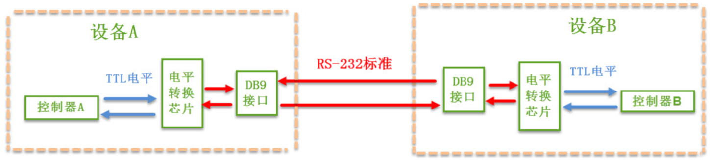
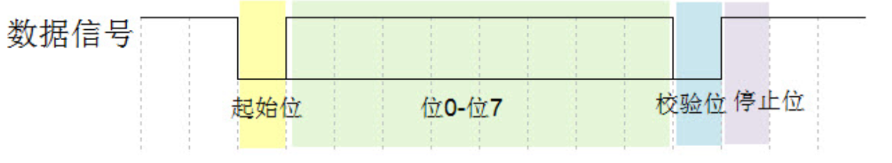
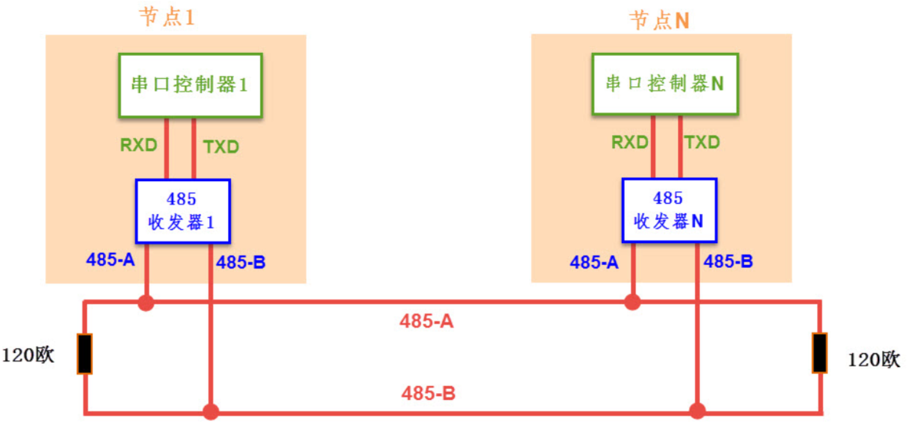

## RS232概念

### 物理层

RS-232使用的电平标准与TTL不同，需要使用电平转换芯片为控制器做转换，RS-232电平标准如下：

| 通讯标准 |                  电平标准 (发送端)                  |
| :------: | :-------------------------------------------------: |
|  5V TTL  |       逻辑 1： 2.4V-5V    ；  逻辑 0： 0~0.5V       |
|  RS-232  | **逻辑** 1： -15V~-3V       ；    逻辑 0： +3V~+15V |

### 协议层

即串口通信的协议形式，数据包就是串口通信数据包：

通信双方需要约定波特率，有起始位和停止位，校验位可自定义，中间的八位是有效数据位。

## RS485概念

电气特性规定为 **2 线，半双工，多点通信**的类型。用缆线两端的电压差值来表示传递信号。 RS485 仅仅规定了接受端和发送端的电气特性。它没有规定或推荐任何数据协议 。RS-485通讯协议由RS-232改进而来，**协议层不变（仍使用串口数据包）**，只是改进了物理层。特点有：

1. 接口电平低，不易损坏芯片。
2. 传输速率高。10 米时， RS485 的数据最高传输速率可达 35Mbps，在 1200m 时，传输速度可达 100Kbps。  
3. 抗干扰能力强。**使用差分信号，这是与RS-232的最大区别。**
4. 传输距离远，支持节点多。RS485 总线最长可以传输 1200m 左右一般最大支持 32 个节点，如果使用特制的 485 芯片，可以达到 128 个或者 256 个节点，最大的可以支持到 400 个节点。  

### 物理层

RS-485网络结构与CAN比较类似，都是两条信号线挂载多个节点，每个节点都由一个通讯控制器和一个收发器，控制器和收发器之间使用TTL电平传输，收发器与总线之间使用差分信号传输。相较于RS-232，RS-485的电平标准如下：

| 通 讯标准 |        信号线        | 通 讯方向 |           电平标准 (发送端)            | 通 讯距离  |                       通讯节点数                       |
| :-------: | :------------------: | :-------: | :------------------------------------: | :--------: | :----------------------------------------------------: |
|   RS232   | 单 端 TXD、RXD、 GND |  全 双工  | 逻辑 1： -15V~-3V    逻辑 0： +3V~+15V | 100米 以内 |                      只有两个节点                      |
|   RS485   |      差分线 AB       |  半 双工  |    逻辑 1： +2V~+6V逻辑 0： -6V~-2V    |   1200米   | 支持多个节点。**支持多个主设备**，任意节点间可互相通讯 |

RS-485 与 RS-232 的差异只体现在物理层上，它们的协议层是相同的，也是使用串口数据包的形式传输数据。  

### 协议层

