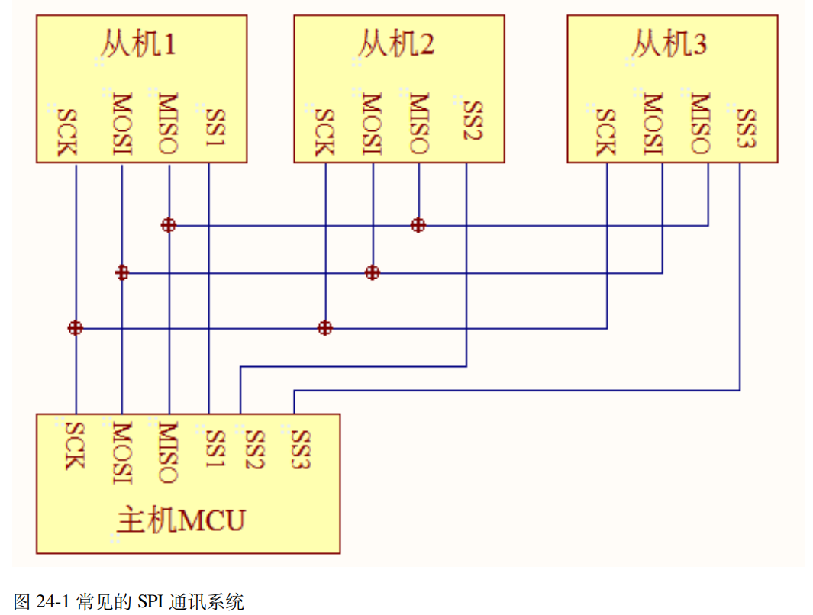
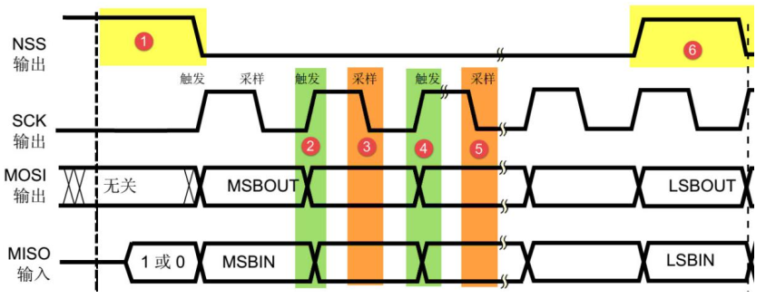
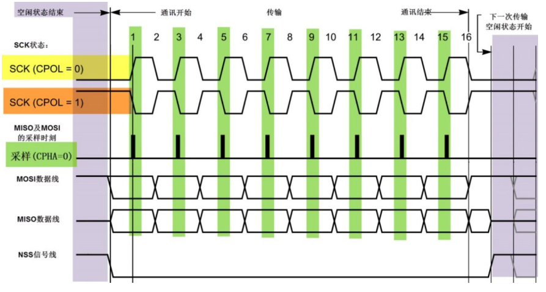
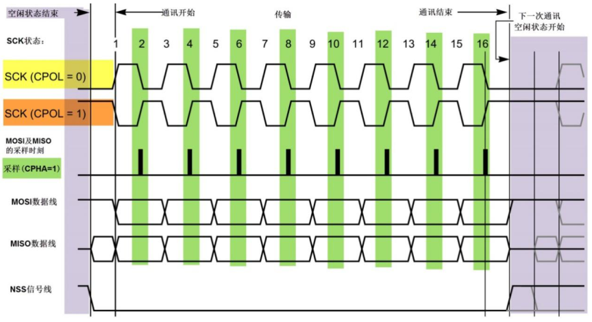

## SPI的概念

SPI(Serial Peripheral Interface) 串行外围设备接口协议是由摩托罗拉公司提出的一种高速**全双工的同步串行通信总线**。  

### SPI物理层

SPI 通讯使用 3 条总线及片选线， 3 条总线分别为 SCK、 MOSI、 MISO，片选线SS，它们的作用介绍如下  ：

**MISO（Master In / Slave Out）：**主设备数据输入，从设备数据输出。

**MOSI（Master Out / Slave In）：**主设备数据输出，从设备数据输入。-

**SCLK（Serial Clock）：**时钟信号，由主设备产生，决定通信速率。两个设备之间通讯时，通讯速率受限于低速设备。

**SS（Slave Select  ）：**片选信号线，常被称为NSS、CS等。SPI协议中没有设备地址，使用NSS信号线来寻址，当主机选择从设备时，将**该从设备的 NSS 信号线设置为低电平**，该从设备即被选中，即片选有效，以 NSS 线被拉高作为结束信号。  

### SPI协议层

SPI通信的通讯时序图如下，**MOSI和MISO数据线在SCK的每个时钟周期传输一位数据**，且数据的输入输出是同时进行的，具体是是MSB先传还是LSB先传可以自行规定。**SPI 每次数据传输可以 8 位或 16 位为单位，每次传输的单位数不受限制。**  

**①起始信号：**NSS信号线由高电平向低电平跳变，表示本次通讯开始，从机被选中。。

**②&④数据变化：**MOSI 及 MISO 的数据在 SCK 的上升沿期间变化输出。每次上升沿变化输出。

**③&⑤数据采样：**MOSI 及 MISO 的数据在 SCK 的下降沿时被采样。即在 SCK 的下降沿时刻， MOSI 及 MISO 的数据有效，高电平时表示数据“1”，为低电平时表示数据“0”  

**⑥停止信号：**NSS 信号由低变高，表示本次通讯结束，从机选中状态被取消。

### SPI的四种工作模式

**时钟极性CPOL：**指SPI设备**空闲时SCK的电平信号**，即**指定时钟的第一个边沿是上升沿还是下降沿**。CPOL=0 时， SCK 在空闲状态时为低电平， CPOL=1 时空闲状态为高电平。

**时钟相位CPHA：**指数据的采样时刻，**指定数据的采样时刻是时钟的奇数边沿还是偶数边沿**。CPHA=0奇数边沿采样，CPHA=1偶数边沿采样。

根据总线空闲时SCK的时钟状态以及对数据线的采样时刻可以将SPI工作模式分为四类，使用比较多的是模式 0 和模式 3。

| SPI 工作模式 | CPOL | CPHA | SCL 空闲状态 | 采样边沿 | 采样时刻 |
| ------------ | ---- | ---- | ------------ | -------- | -------- |
| 0            | 0    | 0    | 低电平       | 上升沿   | 奇数边沿 |
| 1            | 0    | 1    | 低电平       | 下降沿   | 偶数边沿 |
| 2            | 1    | 0    | 高电平       | 下降沿   | 奇数边沿 |
| 3            | 1    | 1    | 高电平       | 上升沿   | 偶数边沿 |

不同工作模式下的具体的时序图示如下：

