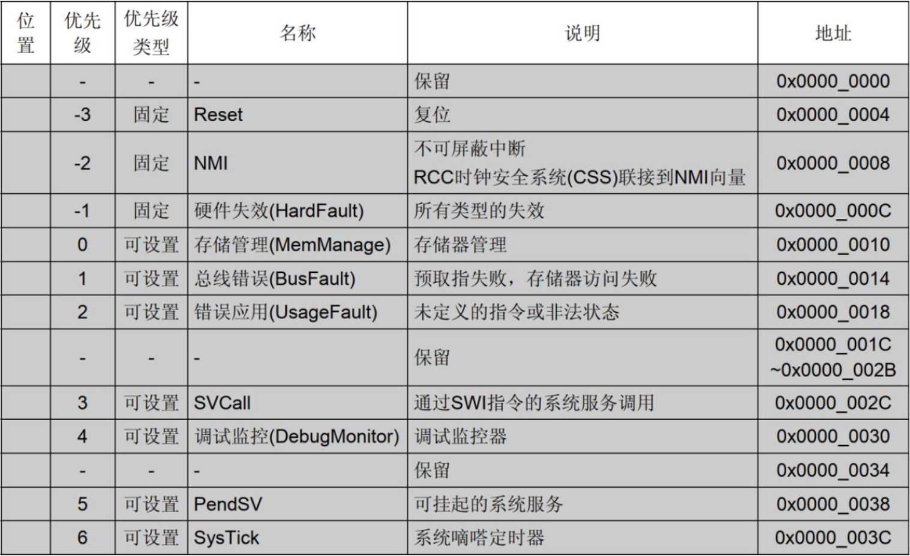
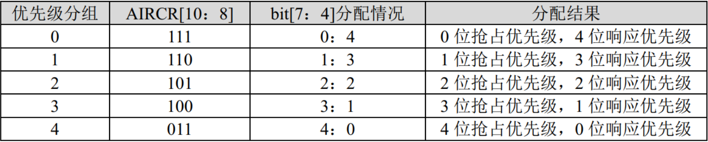
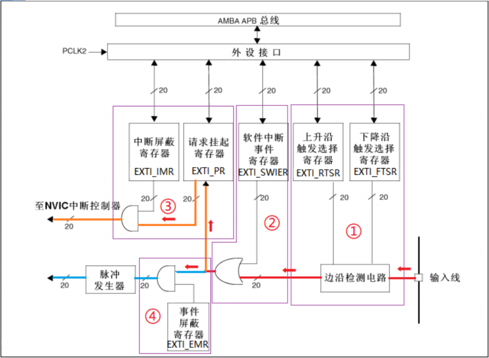
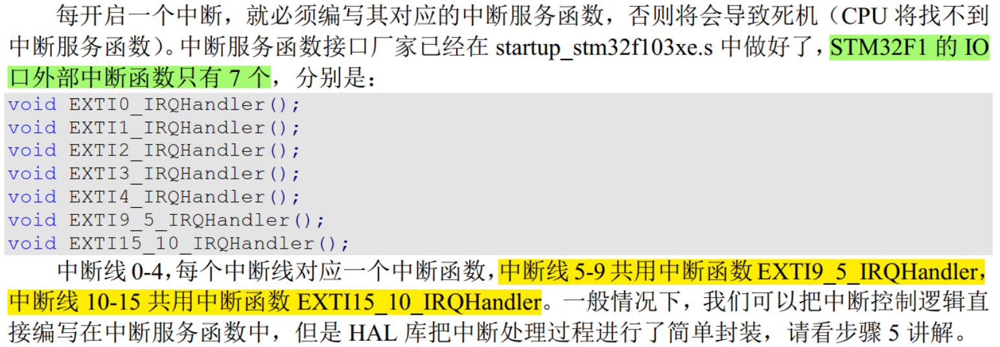
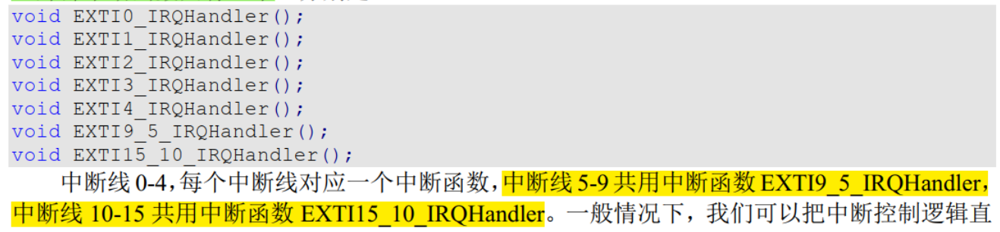
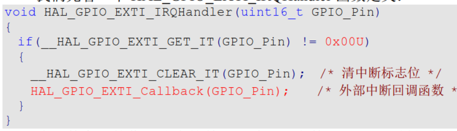

## 中断的概念

在STM32微控制器中，**中断（Interrupt）是一种机制**，允许微控制器响应特定的内部或外部事件。中断发生时，微控制器会暂停当前正在执行的任务，保存当前状态，并跳转到预先定义好的中断服务程序（ISR, Interrupt Service Routine）执行。一旦ISR完成处理，微控制器就会恢复之前被中断的任务继续执行。

Cortex-M3内核支持256个中断，其中包括16个系统中断和240个外部中断，并且具有256级可编程中断设置。然而芯片厂商一般不会把内核的这些资源全部用完，如 **STM32F103ZET6 的系统中断有 10 个，外部中断有 60 个**。 ***与其说支持60个外部中断，不如说支持60个GPIO口作为中断源***。10个系统中断包括：

## 中断优先级

**NVIC** 即嵌套向量中断控制器，全称 Nested vectored interrupt controller。  它**控制着整个芯片中断相关的功能，是内核里面的一个外设**。可以通过NVIC进行中断优先级分组和中断优先级设置、中断使能失能等操作。

STM32 中的中断优先级可以分为：抢占式优先级和响应优先级，响应优先级也称子优先级，每个中断源都需要被指定这两种优先级。  两个中断发生冲突时，抢占优先级高的中断可以打断正在执行的抢占优先级低的中断 ，但**抢占优先级相同时，响应优先级高的中断不能打断响应优先级低的中断**。也就是说，具有相同抢占优先级的中断之间，即使响应优先级不同，也不会发生相互打断的情况。

NVIC中控制外部中断优先级的寄存器有60个，但实际上M3芯片为了精简设计，只使用了每个寄存器的高四位[7:4]，低四位取零，这样以至于最多只有 16 级中断嵌套，即 2^4=16。  STM32F103将中断分为5个组：

## 外部中断控制器EXTI

EXTI（External interrupt/event controller）是外部中断/事件控制器，由20个产生事件/中断请求的边沿检测器组成。由于EXTI中断线数量有限，**STM32支持的60个中断不可能同时存在**，多个GPIO引脚可以通过软件配置共享同一个EXTI线。

EXTI的功能框图如下：

输入线可以是任何一个GPIO口，或者是一些外设的事件。GPIO口作为中断的输入并不被视为GPIO的复用功能，但**GPIO引脚只能选择复用功能和作为中断输入中的一种功能进行工作。**但大多数STM32外设有自己的中断事件和处理机制，因此可以**使用外设自身的中断机制**：。

②是指外部输入的变化和对软件中断事件寄存器的读写操作都可以启动中断/事件线。

STM32 把 GPIO 管脚 **GPIOx.0~GPIOx.15(x=A,B,C,D,E,F,G)分别对应EXTI中断线 0~15**，但中断线每次只能连接到1个IO口上，具体链接到GPIO的哪个port要自行配置。除此之外，EXTI 线 16：连接到 PVD 输出。EXTI 线 17：连接到 RTC 闹钟事件。EXTI 线 18：连接到 USB 唤醒事件。EXTI 线 19：连接到以太网唤醒事件。

> ==注意将STM32F103支持60个外部中断解释为60可能的外部中断源仍存在问题。因EXTI可能的中断来源多达上百个（GPIOA/B/C/D/E/F/G*16）.==
>
> 事件：不进入NVIC，仅用于内部硬件自动控制的，如：TIM、DMA、ADC
>
> 中断：要进入NVIC，有相应的中断服务函数，需要CPU处理

## HAL库外部中断处理流程

GPIO作为外部中断输入时，虽然在代码中MODE设置为上升沿触发或下降沿触发，但其**仍是输入模式**。根据应用需求，可以将GPIO引脚配置为浮空输入、上拉输入或下拉输入（调整内部电阻）。

在使用Cube配置完成后，编写中断服务函数时要注意，STM32F1的 IO 口外部中断函数只有 7 个：

无论使用哪个外部中断函数，HAL库都会调用一个中断通用入口函数：

可以看到，改通用入口函数在清除中断标志位之后调用了外部中断回调函数。外部中断回调函数是弱定义的，我们通过重新实现回调函数编写中断服务控制逻辑。
