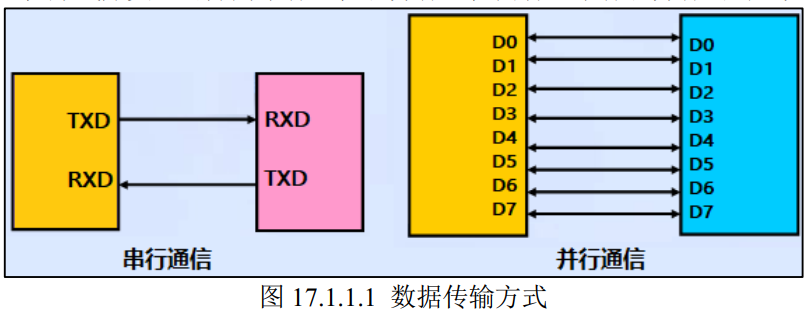
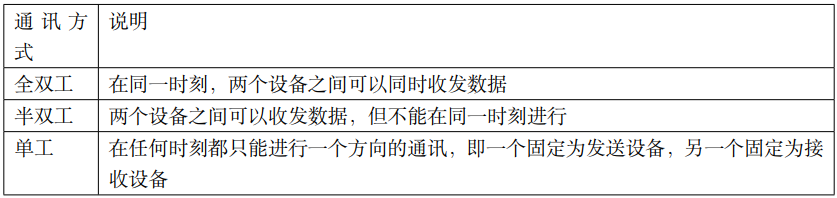
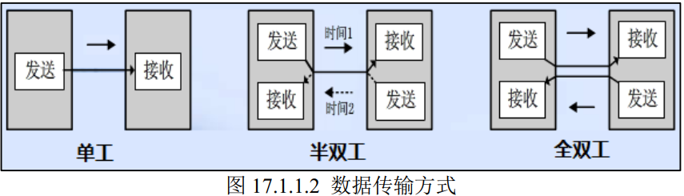
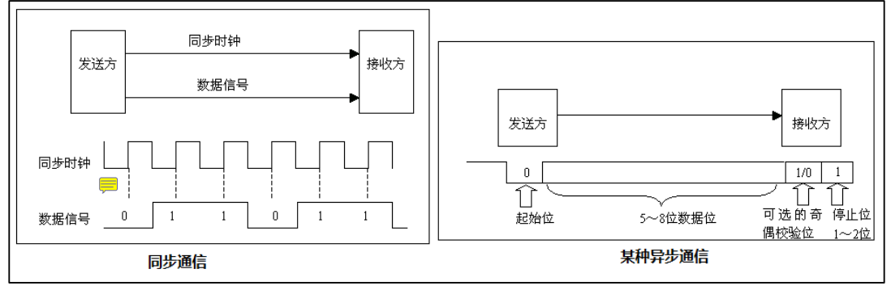
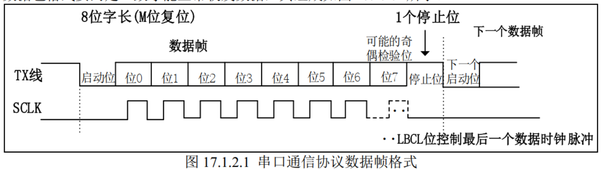
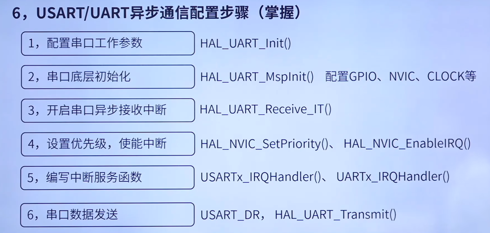
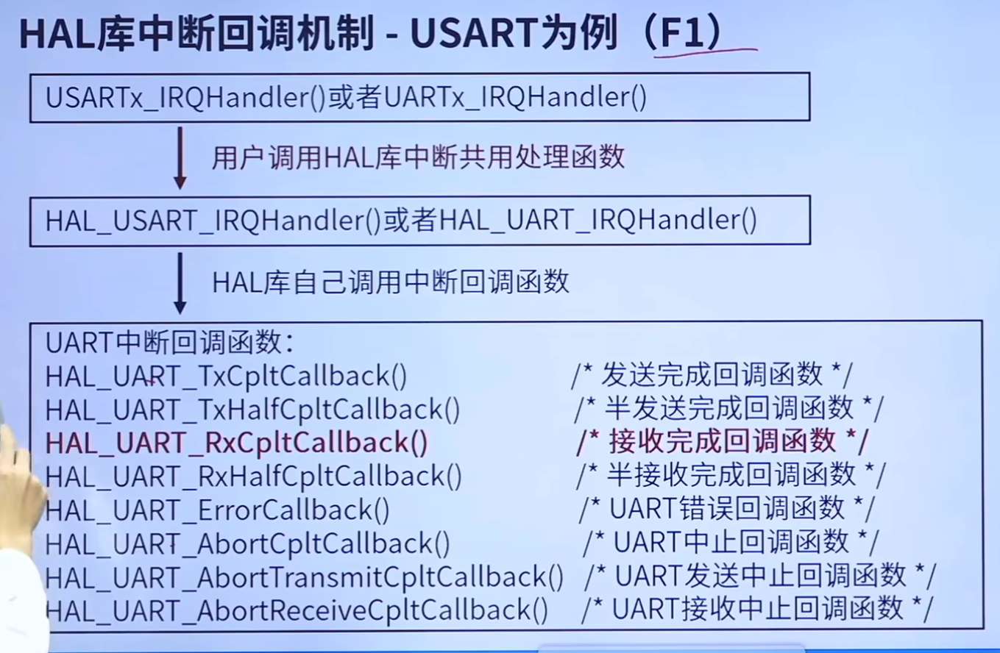

## 通信相关概念

### 串行通信和并行通信

串行通信数据一位一位进行传输，并行通信则多位数据可以同时传输。

### 全双工、半双工及单工通讯  

半双工通信在同一时刻只能是一个设备向另一个发送数据或接收数据，对于同一设备而言，不能一边发送一边接收。这里注意全双工和半双工通信的区别：**半双工通信是共用一条线路实现双向通信**，而**全双工是利用两条线路**，一条用于发送数据，另一条用于接收数据。  

### 同步通信和异步通信

同步通信即双方都知晓同一个时钟信号，按时钟信号在规定的时刻：发送方发送相应的信号，接收方对信号进行采样。

异步通信没有时钟信号，在发送的数据中加入开始位和停止位等进行同步。

### 通信速率（比特率和波特率）

比特率（传信率）：每秒钟传输的二进制位数，单位为bit/s。

波特率（传码率）：每秒钟传输的码元个数，单位为Baud/s。

每个码元由一定数量的二进制数组成，例如十六进制编码码元A由四位二进制数表示。当码元直接使用二进制编码，即每一位二进制数表示一个码元时，传信率=传码率。否则，二者之间的换算关系为：
$$
比特率=波特率*log_{2}M
$$
其中M为表示码元使用的二进制位数，可以理解成码元承载的信息量。

## 串口通信协议

串口通信按照位（bit）发送和接收字节，是**全双工串行通信**，使用一根线发送数据的同时用另一根接收数据。进行串口异步通信的双方需要先约定好波特率，这决定了数据帧中每个bit的传送的时间长度。

**起始位（启动位）**：串口通信一个数据帧是从起始位开始，直到停止位。数据帧中起始位是由一个逻辑 0的数据位表示，而数据帧的**停止位**可以是 0.5、 1、 1.5 或 2 个逻辑 1 的数据位表示，只要双方约定一致即可。  

**停止位**：如图所示，起始位和停止位并不占据我们规定的8位数据长度，而是加在头尾外面一起组成数据帧，就如同TCP/IP协议一般。

**有效数据位**：数据帧的起始位之后，就接着是数据位，也称有效数据位，这就是我们真正需要的数据，有效数据位通常会被约定为 5、 6、 7 或者 8 个位长。**有效数据位是低位（LSB）在前，高位（MSB）在后**。  

**校验位**：奇校验是指**有效数据位和校验位中“1”的个数为奇数**，比如一个 8 位长的有效数据为： 10101001，总共有 4 个“1”，为达到奇校验效果，校验位设置为“1”，最后传输的数据是 8 位的有效数据加上 1 位的校验位总共 9 位。偶校验与奇校验要求刚好相反，要求**帧数据和校验位中“1”的个数为偶数**，比如数据帧： 11001010，此时数据帧“1”的个数为 4 个，所以偶校验位为“0”。0 校验是指不管有效数据中的内容是什么，校验位总为“0”， 1 校验是校验位总为“1”。无校验是指数据帧中不包含校验位。我们一般是使用无检验的情况。**有校验位的情况下，其会加在数据位之后，停止位之前，也不会占据数据位。**

## 串口驱动的编写方法

USART1的RX是PA9，TX是PA10（引脚复用）。与开发版上的TXD和RXD用跳帽相连，传输的数据经TXD和RXD经USB串口转换后传输到电脑。

需要编写的函数有

其中HAL_UART_MspInit()是弱定义，可以直接在板级支持包中重新实现，使用CubeMX配置初始化时，中断服务函数USARTx_IRQHandler()是已经实现过的，直接在对应文件中修改即可。

> **注意的点**：一般所说的高几位和低几位是倒过来的。对一个uint8_t类型的变量而言，其高位是在前面的，如下所示：
>
> | bit7 | bit6 | …    | bit2 | bit1 | bit0 |
> | ---- | ---- | ---- | ---- | ---- | ---- |

## 串口发送、接受数据的几种不同模式

### 阻塞模式发送、接收

即使用 HAL_UART_Transmit 和 HAL_UART_Receive 进行发送接收，这种模式会等待发送或接收指定数量的数据，函数在发送完成或接收到足够数据或超时前会阻塞主程序执行。

### 中断模式发送、接收

即使用串口发送中断 HAL_UART_Transmit_IT 和串口接收中断 HAL_UART_Receive_IT 完成数据的发送和接收，这种模式下不会阻塞主程序执行，数据的发送在后台通过中断完成。**发送完成后会调用 `HAL_UART_TxCpltCallback` 回调函数**。**接收时，每接收到一个字节就会触发中断，并将数据存入缓冲区**。当接收到指定数量的数据后，调用 `HAL_UART_RxCpltCallback` 回调函数。

这种情况需要不断重新调用接受中断HAL_UART_Receive_IT和发送中断HAL_UART_Transmit_IT。

真正的消息接收处理操作写在回调函数中，要注意的是，==**串口收发一个字节数数据（一个数据帧）的逻辑并不需要我们自己来写**==，实际上在回调函数中编写的是如何对收到的数据帧进行组合处理。这里串口接收完成回调函数中写的逻辑实际上是判断字符串是否接收完成，和将每次接收到的一个byte数据放到缓冲区。

### DMA模式发送接收

启动 DMA 传输，让 DMA 控制器负责将数据从内存搬运到 UART 的发送寄存器，或者将 UART 接收寄存器的数据搬运到内存缓冲区。CPU 几乎不参与，效率最高。传输完成后会调用 `HAL_UART_TxCpltCallback` 回调函数或接收指定数量的数据后，调用 `HAL_UART_RxCpltCallback`。
