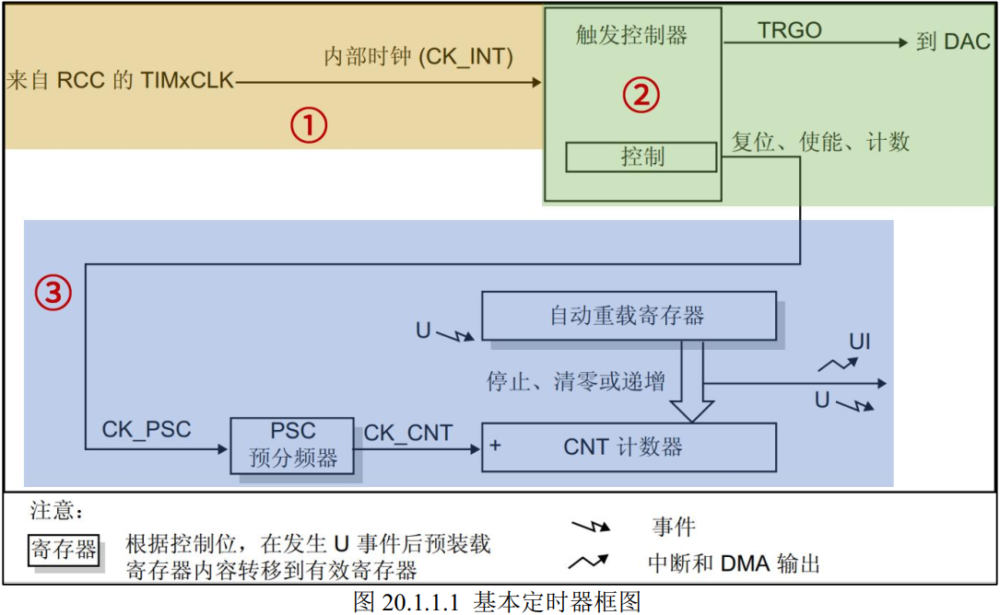
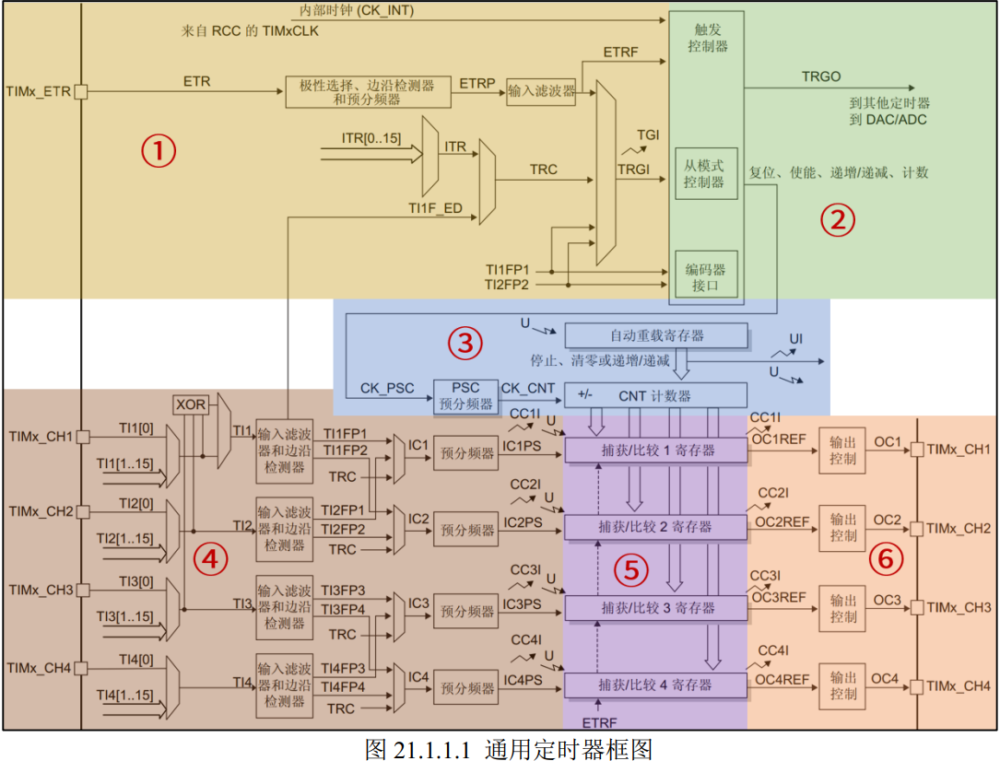
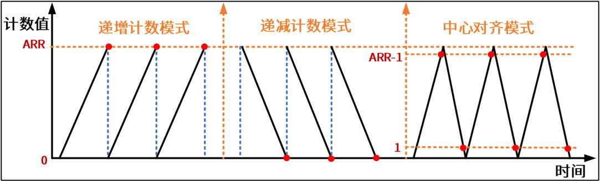
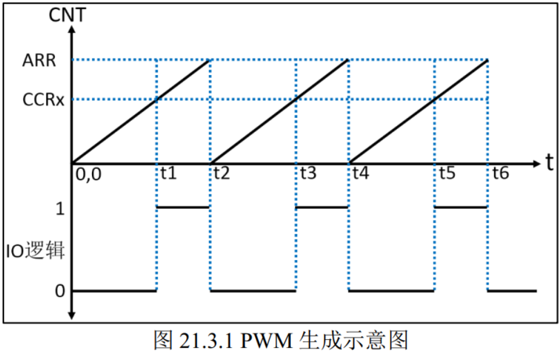

## 定时器概念

定时器顾名思义是**用来定时**的，STM32F1系列产品共有八个定时器，分为基本定时器、通用定时器、高级定时器。其分类的具体情况如下所示：

| 定时器类型 | 定时器              | 计数器位数 | 计数模式             | 预分频系数（整数） | 产生DMA请求 | 捕获/比较通道 | 互补输出 |
| ---------- | ------------------- | ---------- | -------------------- | ------------------ | ----------- | ------------- | -------- |
| 基本定时器 | TIM6/TIM7           | 16         | 递增                 | 1~65536            | 可以        | 0             | 无       |
| 通用定时器 | TIM2/TIM3/TIM4/TIM5 | 16         | 递增、递减、中央对齐 | 1~65536            | 可以        | 4             | 无       |
| 高级定时器 | TIM1/TIM8           | 16         | 递增、递减、中央对齐 | 1~65536            | 可以        | 4             | 有       |

基本定时器没有外部IO，只能定时。通用定时器和高级定时器每个定时器分别有有4个/8个外部IO，可以定时、输出比较、输入捕捉等。

## 基本定时器

**①定时器时钟源。**定时器时钟 TIMxCLK，即内部时钟 CK_INT，经 APB1总线时钟预分频器后分频提供。

**②控制器。**控制定时器复位、使能、计数，触发DAC转换。

**③时基单元。**包括16bit预分频器PSC，16bit自动重装载寄存器和16bit计数器CNT。计数器工作需要的时钟CK_CNT由定时器时钟经PSC预分频后得到，PSC是个十六位的预分频器，最终计数器时钟计算方法如下：**CK_CNT=TIMxCLK/(PSC+1)**  .计数器 CNT 是一个 16 位的计数器，只能往上计数，最大计数值为 65535。当**计数达到自动重装载寄存器中存的值**的时候产生更新事件，并清零从头开始计数。  自动重装载寄存器 ARR 是一个 16 位的寄存器，这里面装着计数器能计数的最大数值。当计数到这个值的时候，**如果使能了中断的话，定时器就产生溢出中断**。  

### 定时时间计算

计时器计一个数的时间：1/CK_CNT

定时器产生一次溢出中断的时间：(1/CK_CNT) * (ARR+1) = (PSC+1)*(ARR+1)/TIMxCLK 	

Q：为什么是ARR+1？

A：因为计数器是从0开始累计的。

### 注意

在进行实验时发现，基本定时器TIM7的需要使用 HAL_TIM_Base_Start_IT(&htim2); // 启动 + 使能更新中断 来启动定时器计数和使能中断，而外部中断没有这一步。这是因为因为 **EXTI 不是一个“运行型”外设**，它不需要“启动”。

- 定时器需要“启动”是因为它有一个**计数器硬件模块**，不启动就不会工作。
- 而 EXTI 是一个**事件检测控制器**，只要配置好，它就一直在监听指定引脚的边沿变化，无需“启动”。

## 通用定时器

通用/高级定时器只是在基本定时器的基础上添加了一些功能，如基本定时器只有更新事件可以触发中断/DMA请求，而通用高级定时器可以通过更新事件、触发事件、输入捕获、输出比较触发中断/DMA请求。

**①时钟源。**通用定时器共有四类时钟源：

1. 内部时钟(CK_INT)，即APB1总线的时钟，与基本定时器相同。
2. 外部时钟模式 1：外部输入引脚(TIMx_CH1,2)，只能来自于通道 1 或者通道 2。TI1F_ED 表示来自于 CH1，并且没有经过**边沿检测**器过滤的信号，所以它是 CH1 的双边沿信号，即**上升沿或者下降沿都是有效（上升沿和下降沿计数器都工作）**的。 TI1FP1/TI2FP2 表示来自 CH1/CH2 并经过边沿检测器后的信号，可以是上升沿或者下降沿，只有一个边沿有效。 
3. 外部时钟模式 2：外部触发输入(ETR) ，外部时钟信号直接通过ETR输出时钟信号，不经TIM_CHx，这种模式下也不存在双边沿有效的模式。
4. 内部触发输入(ITRx)：使用一个定时器作为另一定时器的预分频器，即定时器级联，由上一个定时器的TRGO连接到下一个定时器的ITRx。

**②控制器。**与基本定时器一致，只是TRGO可以连接到其他定时器的ITR引脚了。

**③时基单元。**与基本定时器一致，但通用定时器的计数模式增加到三种：递增计数模式、 递减计数模式和中心对齐模式  ，其不同模式下更新事件的发生条件如下图所示：

注意中心对齐模式下，ARR-1时触发定时器上溢，然后从自动重装载寄存器影子寄存器的值ARR开始递减，到1发生定时器下溢，然后又从0开始递增计数，依次循环。

**④输入捕获。**要和第⑤部分一起完成测量功能，将需要测量的信号输入到相应的IO 端口（TIMx_CHx），**输入捕获部分可以对输入的信号的上升沿，下降沿或者双边沿进行捕获，可以通过这种方式完成输入信号的脉冲宽度、频率、占空比测量。**比如计算一个高电平脉冲的持续时间：将上升沿到来时计数器的值CNT锁存在**捕获/比较寄存器**中，下降沿到来时在锁存一次CNT，最后，我们将前后两次锁存的 CNT 的值相减，就可以算出高电平脉冲期间内计数器的计数个数，  从而计算出高电平脉冲的持续时间。

⑤捕获/比较（④和⑥的公用部分）

**⑥输出比较。** 输出比较就是**通过定时器的外部引脚对外输出控制信号**，有冻结、将通道 X（x=1,2,3,4）设置为匹配时输出有效电平、将通道 X 设置为匹配时输出无效电平、翻转、强制变为无效电平、强制变为有效电平、 PWM1 和 PWM2 这八种模式，具体使用哪种模式由寄存器 CCMRx 的位 OCxM[2:0]配置。其中 PWM 模式是输出比较中的特例，使用的也最多。  一般来说，**当计数器的值和捕获/比较寄存器的值相等时，输出参考信号 oc1ref 的极性就会根据我们选择的输出比较模式而改变**。如果开启了比较中断，还会发生比较中断。

## 通用定时器PWM输出原理

脉冲宽度调制（Pulse Width Modulation）是利用MCU的数字输出对模拟电路进行控制的技术。定时器产生PWM的生成示意图如下：

CNT-计数器计数值	ARR-自动重装载寄存器值	CCRx-捕获/比较寄存器x的值	假设定时器工作在递增模式

当CNT<CCRx 时， IO 输出低电平（逻辑 0）；当 CNT>=CCRx 时， IO 输出高电平（逻辑 1）；当CNT=ARR 时，定时器溢出， CNT 的值被清零，然后继续递增，依次循环。  

可以看出，只需改变CCRx的值，就可以控制PWM的**占空比**，改变ARR值，就可以控制PWM的**频率**。

图中只是以递增模式为例，实际上三种计数模式都可以做到输出PWM。PWM的模式1和2分别代表：

| 模式         | 条件               | 动作                                                         |
| ------------ | ------------------ | ------------------------------------------------------------ |
| **PWM模式1** | 当 `CNT < CCRx` 时 | 输出 **有效电平**（通常为高电平） 当 `CNT >= CCRx` 时，输出 **无效电平**（通常为低电平） |
| **PWM模式2** | 当 `CNT < CCRx` 时 | 输出 **无效电平**（通常为低电平） 当 `CNT >= CCRx` 时，输出 **有效电平**（通常为高电平） |

## 高级定时器

