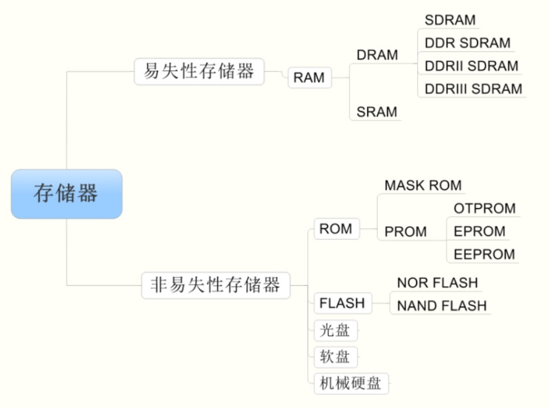

## 存储器种类

存储器是用来存储程序代码和数据的部件，按其存储介质特性主要分为“易失性存储器”和“非易失性存储器”两大类。其中的“**易失/非易失”是指存储器断电后，它存储的数据内容是否会丢失的特性**。  基本存储器种类如下图所示：

### RAM（Random Access Memory）

随机存储器，当存储器中的消息被读取或是写入时，所需的时间与这段信息所在的位置无关。根据 RAM 的存储机制，又分为动态随机存储器 DRAM(Dynamic RAM) 以及静态随机存储器SRAM(Static RAM) 两种。  

动态随机存储器 DRAM 的存储单元以电容的电荷来表示数据，有电荷代表 1，无电荷代表 0。SDRAM则是指在通讯时使用时钟信号的DRAM。

静态随机存储器 SRAM 的存储单元以锁存器来存储数据。

### ROM（Read Only Memory）

只读存储器，由于技术的发展，后来设计出了可以方便写入数据的 ROM，而这个“Read Only Memory”的名称被沿用下来了，现在一般用于指代非易失性半导体存储器  。

EPROM(Erasable Programmable ROM) 是可重复擦写的存储器，它解决了 PROM 芯片只能写入一次的问题。  它的擦除和写入都是直接使用电路控制，不需要再使用外部设备来擦写。而且可以按字节为单位修改数据，无需整个芯片擦除。现在主要使用的 ROM 芯片都是 EEPROM。  