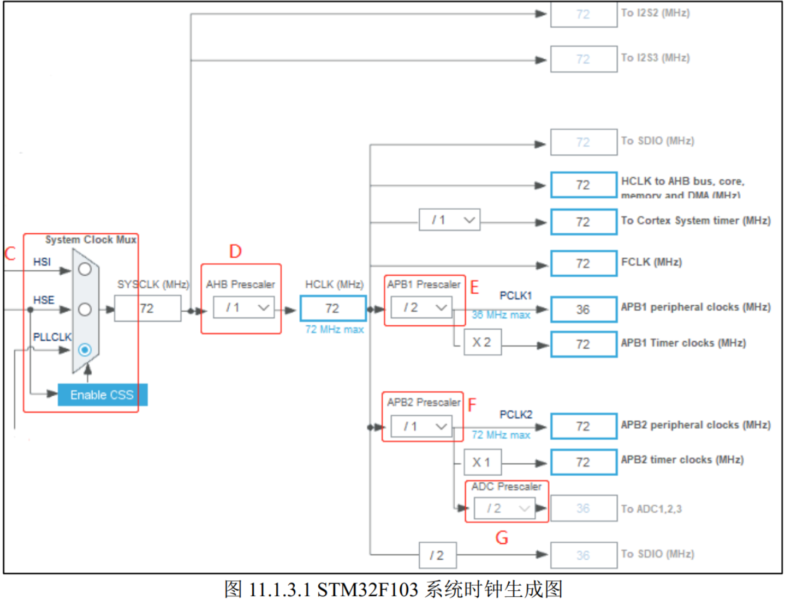

## 时钟的概念

专门用于控制时序的电路，在STM32芯片内部做各种器件的同步工作（例如决定具体何时进行采样）。

## STM32时钟源

### 2个外部时钟源：

高速外部振荡器 HSE (High Speed External Clock signal)  

低速外部振荡器 LSE (Low Speed External Clock signal)  

### 2 个内部时钟源：  

高速内部振荡器 HSI(High Speed Internal Clock signal)  。由内部 RC 振荡器产生，频率为 8MHz。  **用户不进行配置时，芯片上电默认由内部的HSI时钟启动。**

低速内部振荡器 LSI(Low Speed Internal Clock signal)  。由内部 RC 振荡器产生，频率为 40kHz，可作为独立看门狗的时钟源。  

### 锁相环PLL

在 STM32 主控中，锁相环的作用主要有两个部分：输入时钟净化和倍频。  常用的倍频一般与前面的内外部时钟源组合使用，从而得到比时钟源本身更高的时钟频率。

## STM32系统时钟

**APB1 总线最高频率为 36MHz**，片上低速的外设就挂载在该总线上，例如有看门狗定时器、定时器 2/3/4/5/6/7、 RTC 时钟、 USART2/3/4/5、 SPI2(I2S2)与 SPI3(I2S3)、 I2C1 与 I2C2、CAN、 USB 设备和 2 个 DAC。  

APB2 高速总线链接的外设有外部中断与唤醒控制、 7 个通用目的输入/输出口(PA、 PB、 PC、 PD、 PE、 PF和 PG)、定时器 1、定时器 8、 SPI1、 USART1、 3 个 ADC 和内部温度传感器。  

AHB 总线时钟直接作为 SDIO、 FSMC、 AHB 总线、 Cortex 内核、存储器和 DMA 的HCLK 时钟，并作为 Cortex 内核自由运行时钟 FCLK。  
