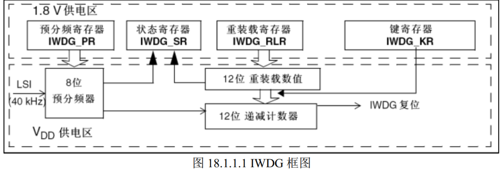

## 看门狗的概念

STM32 有两个看门狗，一个是独立看门狗另外一个是窗口看门狗，独立看门狗号称宠物狗，窗口看门狗号称警犬 。他们都是用来检测是否系统运行是否发生异常的，一旦到时间了还没有人喂狗，则判定为发生了异常。

## 独立看门狗（**Independent**  Watchdog）

独立看门狗本质上是一个 **12 位的递减计数器**，**当计数器的值减到 0 的时候，就会产生一个复位信号**。如果在计数没减到 0 之前，**重置计数器（喂狗）**的值的话，那么就不会产生复位信号。看门狗功能由 VDD 电压域供电，在停止模式和待机模式下仍然可以工作。

STM32F103的IWDG由内部专门的40kHz低速时钟驱动，但这个时钟并不准确，实际上是一个30-60kHz的可变化时钟，40kHz只是我们的估算。八位预分频器可以提供最大 $2^8=256$ 的分频系数。

## 窗口看门狗（**Window Watchdog**）

窗口看门狗是一个**7位计数器(计数范围有限)**，与IWDG不同的是，其只能在计数器的一定范围内进行喂狗操作。在计数器减小到窗口下限（0x40）之下还不喂狗会触发复位，在计数器减小到窗口上限（用户设定）之前进行喂狗也会触发复位。

WWDG的时钟先经历4096分频，再经过2位的预分频器（值为0/1/2/3，分频系数为$2^{0/1/2/3}=1/2/4/8$），T[6:0]存储计数值，W[6:0]存储窗口上限值。总体来说其工作示意图如下：

W[6:0]指用户指定的窗口上限，0x40是窗口下限。WWDG的最大超时时间（**从最大计数值减到窗口下限的时间**）计算公式如下：

因为最小计数值就是0x40->T[6:0]=100 0000，因此T[6]一定为1，因此**T[5:0]就是计数器真正减小的值**，+1是因为不是在计数器0x40时输出复位信号，而是小于窗口下限值，即减到0x3F才复位。

### 最大/最小超时时间的区别：

- **最大超时时间 (Maximum Timeout Period)**：这是你**最晚**可以喂狗的时间点。如果超过这个时间还没喂狗，计数器就会减到 `0x3F` 或更低，从而触发复位。
- **最小超时时间 (Minimum Timeout Period)**：这是你**最早**可以喂狗的时间点。如果在这个时间点之前喂狗，会被视为“过早喂狗”，WWDG会**立即触发复位**。

### WWDG与IWDG的不同之处

WWDG在递减计数器递减到 0X40 的时候，还不会马上产生复位，如果**使能**了**提前唤醒中断EWI**， 则进入中断服务程序里做最重要的工作，比如保存重要数据，或者报警等。也可以在这个中断里进行喂狗，防止复位。  